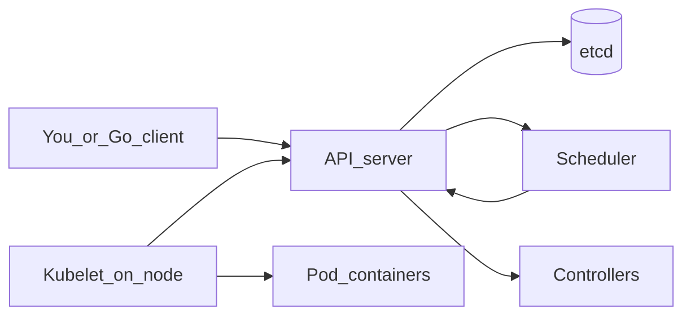
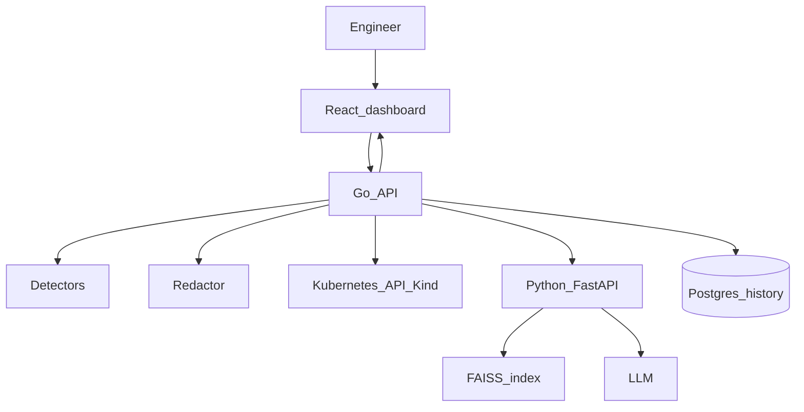

# KubeAssist — Interview Preparation (Kubernetes AI Copilot)

> Study this as if you have never used Kubernetes. Every section starts from the ABC, then shows a **concrete example**, then maps it to **this project**. Memorize the boxed **Say this** lines. A DevOps interviewer will probe wording like “monitor” and “copilot” — those traps are called out up front.

---

## Table of Contents

1. [How to use this document (90-minute plan)](#1-how-to-use-this-document-90-minute-plan)
2. [Interview strategy and resume wording](#2-interview-strategy-and-resume-wording)
3. [Resume claim verification (phrase by phrase)](#3-resume-claim-verification-phrase-by-phrase)
4. [DevOps and Docker from ABC](#4-devops-and-docker-from-abc)
5. [Kubernetes from ABC](#5-kubernetes-from-abc)
6. [Project overview — what KubeAssist is and why it exists](#6-project-overview--what-kubeassist-is-and-why-it-exists)
7. [Architecture](#7-architecture)
8. [All Kubernetes errors we diagnose (with examples)](#8-all-kubernetes-errors-we-diagnose-with-examples)
9. [Go collector, detectors, and the Kubernetes API](#9-go-collector-detectors-and-the-kubernetes-api)
10. [RAG: chunking, sentence-transformers, hybrid retrieval, LLM](#10-rag-chunking-sentence-transformers-hybrid-retrieval-llm)
11. [Evaluation, security, and local deployment](#11-evaluation-security-and-local-deployment)
12. [Interview question bank](#12-interview-question-bank)
13. [Whiteboard and scenario questions](#13-whiteboard-and-scenario-questions)
14. [Cheat sheets](#14-cheat-sheets)
15. [Mock interview (spoken answers)](#15-mock-interview-spoken-answers)
16. [Words never to say / honest scope](#16-words-never-to-say--honest-scope)

---


# 1. How to use this document (90-minute plan)

If the interview is soon, read in this order:


| Time     | Read                                                               |
| -------- | ------------------------------------------------------------------ |
| 10 min   | §2 pitches + §3 resume phrases                                     |
| 20 min   | §4 Docker + §5 Kubernetes ABC (do not skip Pod / Service / probes) |
| 25 min   | **§8 all errors** — this is what a K8s interviewer will quiz       |
| 15 min   | §9 two-pass collector + §10 RAG hybrid                             |
| 10 min   | §14 cheat sheets + §15 mock answers                                |
| leftover | §12 questions you feel weak on                                     |


**Core sentence (memorize):**

> *“KubeAssist is a read-only Kubernetes troubleshooting copilot. Go talks to the Kubernetes API, collects live evidence, and classifies the failure with deterministic rules. Python retrieves official Kubernetes docs with hybrid RAG and an LLM writes a cited diagnosis. We never apply changes to the cluster — the human copies kubectl and runs it.”*

---


# 2. Interview strategy and resume wording

Your resume:

> **Kubernetes AI Copilot**  
> Go • Kubernetes API • Docker • RAG • LLMs  
> Developed an AI-powered Kubernetes troubleshooting assistant using Go and the Kubernetes API to **monitor** Kubernetes cluster resources, analyze **deployment failures**, and generate **incident diagnosis** across containerized workloads.  
> Integrated **Retrieval-Augmented Generation (RAG)** over Kubernetes documentation to provide contextual debugging assistance and explainable root-cause analysis.


## 2.1 Is “Kubernetes AI Copilot” the right wording?

**Yes, if you define it in the first sentence.** In industry, “copilot” means an AI that **sits beside you and suggests**. GitHub Copilot suggests code. Azure Copilot suggests cloud actions. Your copilot **suggests a diagnosis and kubectl commands**.

**It is the wrong wording if** the interviewer hears: the tool SSHs into nodes, runs `kubectl apply`, or is Microsoft’s product.

**Say this:**

> “I called it a copilot because it assists a developer the way Copilot assists a coder — it reads context and proposes the next step. It is **not** GitHub Copilot and it does **not** mutate the cluster. A more precise name is KubeAssist: a read-only troubleshooting assistant.”

If they smirk at “copilot,” smile and switch to “assistant.” Do not argue branding.

## 2.2 Resume words a DevOps person will attack


| Resume word             | They may think                                | You mean                                                                                    | Say this                                                                                                                      |
| ----------------------- | --------------------------------------------- | ------------------------------------------------------------------------------------------- | ----------------------------------------------------------------------------------------------------------------------------- |
| **Monitor**             | Prometheus, Grafana, Datadog, metrics, alerts | Watch cluster **state** via the Kubernetes API (`get/list/watch` pods, events, logs)        | “Not metrics monitoring. We observe resource state through the API — like a smart `kubectl get/describe/logs`.”               |
| **Deployment failures** | Only `apps/v1` Deployment objects             | Workload failures in a Deployment-managed pod (CrashLoop, image pull, etc.)                 | “We diagnose the Pod and its owners. A Deployment is how the lab workloads are declared; the failure often shows on the Pod.” |
| **Incident diagnosis**  | PagerDuty, postmortems, SLO burn              | Structured SRE write-up: summary, evidence, cause, steps, citations                         | “Incident here means ‘this workload is broken right now,’ not an on-call ticket system.”                                      |
| **Docker**              | You wrote Dockerfiles for a SaaS              | Kind cluster runs **inside Docker**; lab images are Docker images; services can be composed | “Docker is the runtime under Kind and the packaging for the demo, not a replacement for Kubernetes.”                          |
| **RAG**                 | “We dumped docs into ChatGPT”                 | Offline index of kubernetes.io + retrieve-then-generate with citations                      | See §10.                                                                                                                      |
| **LLMs**                | The model decides the failure type            | LLM **explains**; Go **classifies**                                                         | “The LLM is not allowed to change `failureType`.”                                                                             |


## 2.3 Strategic message for a Kubernetes-expert interviewer

Lead with **correctness**, not with AI hype.

> “The interesting problem is that CrashLoopBackOff is a **symptom**, not a cause. OOM, a bad liveness probe, and an app `exit 1` all look like CrashLoop. If I let an LLM classify that, it will be confidently wrong. So Go applies ordered detectors on live API evidence, and the LLM only explains the type Go already chose, using retrieved official docs.”

That is an answer a senior DevOps engineer respects.

## 2.4 Pitches (memorize 15s + 60s)

**15 seconds**

> “KubeAssist is a read-only AI copilot for Kubernetes. You pick a failing pod; Go collects status, events, and logs from the API and classifies the failure; RAG pulls the matching Kubernetes docs; an LLM writes a cited diagnosis and copy-paste kubectl. It never applies fixes.”

**30 seconds**

> “Developers see CrashLoopBackOff and guess. The same waiting reason can mean the app crashed, a probe killed it, or it was OOMKilled. I built a copilot that treats the cluster as the source of truth: a Go collector does a two-pass gather against the Kubernetes API, redacts secrets, and runs deterministic detectors. Python does hybrid RAG over kubernetes.io — keyword search for exact error strings plus sentence-transformer semantic search — then the LLM explains with citations. We evaluate on eight Kind lab failures.”

**60 seconds**

> “Kubernetes already tells you what is wrong — in events, container state, and logs — but the signal is scattered and easy to misread. ChatGPT without cluster access invents log lines. So I split the system on a trust boundary: only Go holds kubeconfig and talks to the API. It always collects core Pod evidence, then expands to Services or ConfigMaps only when the detector says it needs them. Detectors set `failureType` with a priority list so ProbeFailure beats CrashLoop, and OOMKilled beats CrashLoop, because those are more specific. Python is JSON-in, JSON-out. We embed curated Kubernetes documentation with sentence-transformers, store vectors in FAISS, and retrieve with a hybrid of BM25 and dense similarity so both `ImagePullBackOff` and ‘cannot pull image’ hit the images docs. The LLM must echo Go’s type, only cite retrieved URLs, and only paraphrase snapshot evidence. Commands are labeled manual. Postgres stores investigation history, not cluster state. The demo lab is a Kind cluster with eight broken Deployments.”

**2-minute technical add-on** (after 60s)

> Add: schemaVersion 1.1.0 contracts; SSE stages collecting → detecting → retrieving → diagnosing → done; log/event caps 200 lines / 32KiB and 30 events; previous logs only if `restartCount > 0`; confidence `0.5*detector + 0.3*retrieval + 0.2*LLM`; timeouts K8s 5–10s, AI 60–90s, overall 120s; `LLM_MOCK` for demos without a key; read-only ClusterRole with no Secrets verb.

**Non-technical / HR**

> “When an app breaks in Kubernetes, the dashboard just says CrashLoop and a junior engineer panics. My project reads the same information a senior would read — status, events, logs, docs — and writes a clear report: what happened, why, how to verify, how to fix, and links to official documentation. A person still runs the fix.”

**Senior engineer**

> “The design law is evidence first, classification without an LLM, generation with retrieval and a validator. The LLM is untrusted: type echo, citation allowlist, evidence grounding. Collection is two-pass to avoid a noisy always-fetch-everything snapshot. RAG is hybrid because Kubernetes error tokens are unique strings while user questions are paraphrases. I would not put Prometheus in v1 — this is a debugger, not an observability platform. Production hardening would be in-cluster ServiceAccount, NetworkPolicy around the AI service, and swapping the local FAISS file for a managed index if we went multi-replica.”

---


# 3. Resume claim verification (phrase by phrase)


## 3.1 “Kubernetes AI Copilot” — defensible

- **Meaning:** AI assistant for K8s debugging.
- **Say:** “Copilot = suggest diagnosis + commands. Read-only.”
- **Challenge:** “So it runs kubectl?” → “No. The UI copies commands. The ServiceAccount cannot create/update/delete/exec.”


## 3.2 “Go • Kubernetes API”

- **Meaning:** Backend is Go using `client-go` (the official Kubernetes client library).
- **Why Go:** Kubernetes itself is Go; `client-go` is first-class; typed detectors and concurrency (`errgroup`) are natural; we keep Python for RAG/LLM only.
- **Say:** “Go is the only process with kubeconfig. It calls the API server like kubectl does, programmatically.”
- **Challenge:** “Why not the Python kubernetes client?” → “Python still needs a cluster client and we’d mix classification with LLM code. Splitting means Python never sees credentials and we can unit-test detectors as pure functions on JSON.”


## 3.3 “Monitor Kubernetes cluster resources”

- **Does not mean:** scraping node CPU, PromQL, alerting rules, SLOs.
- **Does mean:** list namespaces/pods; read pod phase, conditions, container waiting/terminated reasons, restart counts, probes, events, logs, owners, related Services/ConfigMaps.
- **Say:** “Monitoring in this bullet is **state observation via the API**, on demand when you troubleshoot, plus a short in-memory TTL cache for the pod list so the dashboard doesn’t hammer the API. Troubleshoot itself is always a fresh collect.”


## 3.4 “Analyze deployment failures”

- Lab workloads are **Deployments**. The failing unit you click is usually a **Pod**.
- Go walks the owner chain: Pod → ReplicaSet → Deployment (summaries + sanitized YAML excerpts).
- **Say:** “Deployment is the desired replica count and template. The failure symptoms appear on Pods the ReplicaSet created. We analyze both.”


## 3.5 “Incident diagnosis across containerized workloads”

- Output is a **DiagnosisResponse**: issue summary, observed evidence, root cause, reasoning, confidence, resolution steps, verification commands, rollback, documentation references, uncertainty notes.
- **Say:** “Same shape as a junior SRE’s incident note, generated from live evidence plus docs.”


## 3.6 “RAG over Kubernetes documentation”

- Curated kubernetes.io pages (Pods, probes, images, memory, ConfigMaps, scheduler, Services) — **not** a crawl of the entire site.
- Offline chunk → embed with **sentence-transformers** → FAISS. Query-time **hybrid retrieval**. Citations must be URLs that were retrieved.
- **Say:** “The model is not allowed to quote a doc we did not retrieve. That is how we keep root-cause analysis explainable.”


## 3.7 “Explainable root-cause analysis”

Explainable means three layers:

1. **Detector evidence** — strings copied from the cluster (“waiting reason CrashLoopBackOff”, “exit code 1”).
2. **Citations** — kubernetes.io title + URL + snippet.
3. **Uncertainty notes** — “previous logs unavailable”, “pod never scheduled so there are no container logs.”

---


# 4. DevOps and Docker from ABC


## 4.1 What is DevOps?

**ABC:** You write an app. Someone has to **build** it into an artifact, **ship** it to a machine, **run** it, and **notice** when it dies. DevOps is the culture and tooling for that loop (CI/CD, containers, IaC, observability).

**Example:** A team pushes to GitHub → CI builds a Docker image → CD deploys it to Kubernetes → Prometheus alerts if error rate spikes → an engineer debugs.

**KubeAssist’s place:** we are **not** the CI/CD or the alerting stack. We sit in the **debug** step: “this Pod is unhealthy, tell me why in English, with official docs.”

**Say this if they ask “is this a DevOps tool?”**

> “It is a developer/DevOps **debugging** assistant. It does not replace Jenkins, Argo CD, or Prometheus. It reduces time-to-understand after Kubernetes already shows a bad state.”


## 4.2 Virtual machine vs container

**VM:** a whole guest OS (Windows/Linux) on a hypervisor. Heavy, slow to start, strong isolation.

**Container:** the app + its libraries, sharing the **host kernel**. Fast, small, packaged as an **image**.

**Example:** nginx as a VM might be a 2 GB Linux VM. `nginx:1.27-alpine` as a container is tens of MB and starts in seconds.

Kubernetes **schedules containers** (wrapped in Pods). Docker is one **container runtime** that can create those containers.

## 4.3 Image vs container vs registry


| Term          | Analogy                    | Example                                                                                           |
| ------------- | -------------------------- | ------------------------------------------------------------------------------------------------- |
| **Image**     | Class / recipe (read-only) | `busybox:1.36`, `python:3.13-alpine`                                                              |
| **Container** | Running instance           | The crashloop lab process that prints FATAL and `exit 1`                                          |
| **Registry**  | Shelf of recipes           | Docker Hub; in the image-pull lab we point at `registry.invalid.example/...` which does not exist |


**Example (our CrashLoop lab):**

```yaml
image: busybox:1.36
command: ["sh", "-c", "echo FATAL...; sleep 2; exit 1"]
```

Kubernetes pulls `busybox:1.36` (if not cached), starts a container, the process exits 1, kubelet restarts it, you see **CrashLoopBackOff**.

## 4.4 Why orchestration (why Kubernetes, not “just Docker”)

**One container on your laptop:** `docker run` is enough.

**Production shape:** 20 microservices, 3 replicas each, rollouts, health checks, service discovery, restart-on-crash, place Pods on machines that have enough RAM.

**Example problem Docker Compose does not solve well:** node dies; you want replicas to reschedule automatically, a Service IP that stays stable, and a rolling update with probes.

Kubernetes is that control plane. **Kind** (Kubernetes in Docker) gives you a real API server on a laptop so we can break Pods on purpose.

## 4.5 Docker in *this* project (so you don’t overclaim)

Three uses, keep them distinct:

1. **Kind node** = a Docker container that *is* a Kubernetes node. Inside it, kubelet runs *your* app containers.
2. **Lab images** = public images (`busybox`, `nginx`, `python`) used by broken Deployments.
3. **App packaging (demo)** = docker-compose can run Postgres + AI service + Go API as containers next to Kind.

**Say:** “Docker is the substrate. Kubernetes is the API we diagnose. Users of KubeAssist do not docker-exec into nodes; they use the dashboard / API.”

## 4.6 What we deliberately are not (monitoring tools)

A DevOps interviewer lives in this vocabulary. Know the difference:


| Tool                     | Job                 | In KubeAssist?                                           |
| ------------------------ | ------------------- | -------------------------------------------------------- |
| Prometheus               | Time-series metrics | No (out of MVP)                                          |
| Grafana                  | Dashboards          | No                                                       |
| Loki / ELK               | Log aggregation     | No — we read **current pod logs** via the API, truncated |
| Jaeger                   | Tracing             | No                                                       |
| Alertmanager / PagerDuty | Pages humans        | No                                                       |
| Helm                     | Package K8s YAML    | No — raw manifests in `k8s/lab/`                         |
| Istio                    | Service mesh        | No                                                       |
| Argo CD                  | GitOps deploy       | No                                                       |


**Say:** “Those are complementary. If Prometheus says error rate is up, you still need to ask *which* Pod and *why*. That why is our job.”

---


# 5. Kubernetes from ABC


## 5.1 The one-sentence model

> You give Kubernetes a **desired state** in YAML (“run 1 replica of this template”). Kubernetes **reconciles** forever until reality matches, or it keeps retrying and emitting **events**.

**Example:** You apply a Deployment with `replicas: 1`. If the container dies, Kubernetes starts another. If the image cannot be pulled, it keeps backing off and the Pod stays Pending.

## 5.2 Cluster, control plane, nodes




- **API server:** the only front door. kubectl and our Go backend both speak HTTPS to it.
- **etcd:** key-value store of cluster state (you rarely touch it).
- **Scheduler:** picks a **node** for a new Pod (`nodeName` empty until then).
- **Controllers:** e.g. Deployment controller creates ReplicaSets; ReplicaSet creates Pods.
- **Kubelet:** agent on each node; starts containers, runs probes, reports status.

**Example:** FailedScheduling lab — scheduler **cannot** find a node with 1000 CPUs and 1Ti RAM, so the Pod stays Pending and an event `FailedScheduling` appears. Kubelet never starts the container. **There are no application logs.**

## 5.3 kubectl is just an API client

`kubectl get pods` = HTTP GET to the API server.

Our Go service does the same with `client-go`. That is the resume’s “Kubernetes API.”

**Example:**

```text
kubectl get pods -n kubeassist-lab
kubectl describe pod -l app=crashloop-app -n kubeassist-lab
kubectl logs -l app=crashloop-app -n kubeassist-lab --previous
```

KubeAssist automates that gather + interpretation.

## 5.4 Namespace

A namespace is a folder for names. `kubeassist-lab` holds all eight demos so they do not collide with `kube-system`.

**Example:** Two teams can both have a Deployment named `web` in `team-a` and `team-b`.

## 5.5 Pod — the smallest deployable unit

A **Pod** is one or more containers that share network and (optionally) volumes. Usually **one app container** per Pod.

**Mental model:** a Pod is a wrapper. You rarely run a raw container in Kubernetes; you run a Pod.

**Pod** `phase` **(exam question):**


| Phase     | Meaning                                         | Example in our lab                           |
| --------- | ----------------------------------------------- | -------------------------------------------- |
| Pending   | Accepted, not fully running yet                 | Image pull, scheduling, config error         |
| Running   | Bound to a node; at least one container started | CrashLoop, OOM, probe, healthy, service-demo |
| Succeeded | All containers exited 0                         | Not used in lab                              |
| Failed    | All containers ended badly and will not restart | Rare with Deployments (they restart)         |
| Unknown   | Node communication lost                         | Not in lab                                   |


**Important:** Phase **Running** does **not** mean healthy. CrashLoop Pods are often `Running` because the kubelet keeps restarting the container.

## 5.6 Container state — where the real error string lives

Inside the Pod, each container has:

- `state.waiting.reason` — why it is not running **now** (CrashLoopBackOff, ImagePullBackOff, CreateContainerConfigError, ErrImagePull, …)
- `state.terminated.reason` — how it last died (OOMKilled, Error, Completed)
- `lastState` — previous termination while currently waiting
- `restartCount`
- `ready` (passed readiness probe)

**Example (OOM lab):** Right now you may see **waiting: CrashLoopBackOff**, but `lastState.terminated.reason = OOMKilled`. If you only read the waiting reason, you mis-diagnose. **Our detector looks at lastState.**

## 5.7 Deployment, ReplicaSet, Pod (owner chain)

```text
Deployment  (you wrote this YAML)
    └── ReplicaSet  (hash in the name, owns current template)
            └── Pod(s)  (the things that actually crash)
```

**Example:** `crashloop-app` Deployment wants 1 replica. You fix the template and roll out; ReplicaSet changes; new Pods appear.

KubeAssist stores owner refs and sanitized YAML excerpts so the diagnosis can say “this comes from Deployment X.”

## 5.8 Labels and selectors

Labels are key-value tags on objects. Selectors are queries.

**Example (healthy):**

```yaml
# Pod
labels:
  app: healthy-app
# Service
selector:
  app: healthy-app
```

Endpoints fill with the Pod’s IP. Traffic works.

**Example (broken-service):**

```yaml
# Pod
labels:
  app: service-demo
# Service broken-service
selector:
  app: wrong-label
```

**Zero endpoints.** Pod is **healthy**. Users still cannot reach the app through that Service. This is why “only look at the Pod” is wrong — pass-2 must fetch Services.

## 5.9 Service and Endpoints

- **Service:** stable virtual IP + DNS name inside the cluster (`broken-service.kubeassist-lab.svc`).
- **Endpoints / EndpointSlices:** the actual Pod IPs currently selected.

**Example to say out loud:**

> “The Pod can be Ready and the Service can still be broken. I check `kubectl get endpoints`. If it is empty, I compare Service selector vs Pod labels.”


## 5.10 ConfigMap and Secret

**ConfigMap:** non-secret config as keys (our `application-config` has `api-url` only).

**Secret:** sensitive keys (tokens, passwords). **Our RBAC does not allow** `get` **on Secrets.** Missing Secret still shows up as `CreateContainerConfigError` in **events**.

**Example:** Pod env:

```yaml
env:
  - name: DATABASE_URL
    valueFrom:
      configMapKeyRef:
        name: application-config
        key: database-url   # THIS KEY DOES NOT EXIST
```

Kubelet cannot create the container. Waiting reason: **CreateContainerConfigError**. No app logs.

## 5.11 Probes (liveness, readiness, startup)

Kubernetes can HTTP-get or exec a check.


| Probe         | Question it answers        | If it fails                                                 |
| ------------- | -------------------------- | ----------------------------------------------------------- |
| **Readiness** | Should we send traffic?    | Pod removed from Endpoints; process **not** killed          |
| **Liveness**  | Is the process dead/stuck? | Kubelet **kills** the container → restart → often CrashLoop |
| **Startup**   | Still booting?             | Disables liveness until success; use for slow starts        |


**Example (probe-failure lab):** App needs **30s** to start (`sleep 30` then httpd). Liveness starts after **2s**, every **3s**, fails after **2** failures. Kubelet kills the container during boot. Events: **Unhealthy**, **Killing**. Waiting looks like CrashLoopBackOff. **True class: ProbeFailure**, not “the app crashed.”

## 5.12 Requests, limits, scheduler, OOM

- **request:** “I need at least this much” — scheduler uses this to place the Pod.
- **limit:** “I may not use more than this” — kubelet/cgroup enforces; memory over limit → **OOMKilled**.

**Example (scheduling):** requests `cpu: "1000"` (one thousand cores) and `memory: 1Ti`. No Kind node has that. Event: **FailedScheduling**. Phase: Pending.

**Example (OOM):** limit `32Mi`, Python appends 10MiB bytearrays in a loop. Linux kills the process. `terminated.reason = OOMKilled`. Then CrashLoop as it restarts.

## 5.13 Events vs logs (do not confuse them)


|            | Events                                                  | Logs                                                      |
| ---------- | ------------------------------------------------------- | --------------------------------------------------------- |
| Who writes | Kubernetes (kubelet, scheduler)                         | Your application stdout/stderr                            |
| Example    | `FailedScheduling`, `Unhealthy`, `Failed` to pull image | `FATAL: database configuration is invalid`                |
| When empty | Rare                                                    | Pending pods that never started; image pull; config error |


**Say:** “ImagePull and FailedScheduling have **events**, almost never app logs. CrashLoop needs **logs and previous logs** after restarts.”

Our caps: max **30** events (newest first); logs max **200 lines or 32 KiB**; previous logs **only if** `restartCount > 0`.

## 5.14 RBAC (why we are read-only)

Kubernetes authz is **verbs × resources**.

Our ClusterRole allows `get`, `list`, `watch` on pods, pods/log, events, services, endpoints, configmaps, deployments, etc.

**Not granted:** `create`, `update`, `patch`, `delete`, `exec`, **secrets**.

**Example:** Even if the LLM says `kubectl delete pod`, our backend **cannot** do that with this role. The product design matches the credentials.

## 5.15 YAML desired state (tiny example)

```yaml
apiVersion: apps/v1
kind: Deployment
metadata:
  name: healthy-app
spec:
  replicas: 1
  selector:
    matchLabels:
      app: healthy-app
  template:
    spec:
      containers:
        - name: web
          image: nginx:1.27-alpine
```

You `kubectl apply`. Kubernetes creates Pods from `template`. Our lab is eight of these files, some intentionally wrong.

---


# 6. Project overview — what KubeAssist is and why it exists


## 6.1 The pain

A junior runs:

```text
kubectl get pods
# crashloop-app-xxxx   0/1   CrashLoopBackOff
```

They Google “CrashLoopBackOff” and get generic advice. They do not notice:

- the **probe** is killing a slow app, or
- **lastState** is OOMKilled, or
- the Pod is fine and the **Service selector** is wrong.

Meanwhile ChatGPT, given no cluster, **invents** log lines and wrong fixes.

## 6.2 The thesis

1. **Evidence first** — live (or fixture) `DiagnosticSnapshot` from the API.
2. **Detectors classify; LLM explains** — same snapshot ⇒ same `failureType`.
3. **RAG cites official docs** — version-aware when possible.
4. **Read-only** — recommend, do not apply.
5. **Secrets never go to the model** — redact tokens, PEM, password-like strings; no Secret values.


## 6.3 Why a normal chatbot is insufficient


| Chatbot                               | KubeAssist                                 |
| ------------------------------------- | ------------------------------------------ |
| No live pod state                     | Go snapshot                                |
| Invents logs                          | Evidence validator                         |
| Mixes CrashLoop causes                | Ordered detectors                          |
| Random blog links                     | Retrieval allowlist (kubernetes.io chunks) |
| Might suggest `kubectl apply` blindly | Commands labeled manual; RBAC cannot apply |


## 6.4 Why RAG (and why not fine-tune Kubernetes into the model)

Docs change per release. Fine-tuning is stale and cannot **cite a URL**. Retrieval at request time + `serverVersion` filter prefers matching doc version.

## 6.5 Why the LLM is not an agent with kubectl tools

Giving the model a `run_kubectl` tool is how you get accidental deletes and prompt injection via log text.

**Say:** “We are not an agentic cluster operator. We are retrieve-and-explain on a snapshot. Python cannot call the Kubernetes API.”

## 6.6 Users and flow

1. Engineer opens dashboard, selects namespace `kubeassist-lab`, sees pod table (phase, restarts, waiting reason).
2. Opens a pod, optionally types a question, optionally passes `serviceName`.
3. Clicks Diagnose (SSE progress).
4. Reads diagnosis; copies verification commands; **manually** fixes YAML; re-diagnoses until Healthy.

---


# 7. Architecture


## 7.1 High-level




**Trust boundary:** kubeconfig / ServiceAccount **only on Go**. Python receives redacted JSON + bearer token `AI_SHARED_TOKEN`.

## 7.2 Request path (troubleshoot)

```text
UI POST /api/pods/{ns}/{name}/troubleshoot
  → Go CollectCore (pod, events, logs, owners)
  → Detect
  → CollectRelated if needed (Services, ConfigMap keys)
  → Redact
  → POST /ai/troubleshoot  (DiagnosticSnapshot)
  → Python hybrid retrieve + LLM + validate
  → DiagnosisResponse
  → Go save investigation in Postgres
  → UI shows sections (+ investigation id)
```

SSE stages: `collecting` → `detecting` → `retrieving` → `diagnosing` → `done`.

## 7.3 Two-pass collection (why)

Always-fetch-everything is slow and leaks extra YAML.


| Pass      | What                                              | When                                    |
| --------- | ------------------------------------------------- | --------------------------------------- |
| 1 Core    | Pod, containers, conditions, events, logs, owners | Always                                  |
| 2 Related | Services + endpoints; ConfigMap **names/keys**    | Detector / `serviceName` / config error |


## 7.4 Contracts

- Go → Python: `schemas/diagnostic-snapshot.schema.json` (`schemaVersion` 1.1.0)  
- Python → Go: `schemas/diagnosis.schema.json`  
- `additionalProperties: false` — extra fields fail validation (keeps teams honest)


## 7.5 Postgres role

**Investigation history only** (replay a past diagnosis). Not the vector store. Not cluster state. FAISS stays on disk in the AI service.

---


# 8. All Kubernetes errors we diagnose (with examples)

This is the section to know cold. For each type: **what the user sees**, **a tiny YAML/log example**, **what people confuse it with**, **what we collect**, **typical fix**.

**Detector priority (more specific wins):**  
Evicted → InitContainerFailure → ImagePullBackOff → OOMKilled → VolumeMountFailure → CreateContainerConfigError → FailedScheduling → ProbeFailure → CrashLoopBackOff → ReadinessFailure  

`ServiceSelectorMismatch` overrides **Healthy only** (pod may be fine).

`ErrImagePull` is **not** a `failureType`. Go sends **ImagePullBackOff** and puts `ErrImagePull` in **evidence**.

---


## 8.1 Healthy (control)

**What it is:** Pod Ready; Service (if any) has endpoints. We need this so detectors do not scream on a good workload.

**Example lab:** `healthy-app` — nginx, modest requests, Service selector `app: healthy-app`.

```text
kubectl get pods -n kubeassist-lab -l app=healthy-app
# 1/1  Running
kubectl get endpoints healthy-app -n kubeassist-lab
# shows a Pod IP
```

**Say:** “Healthy is a first-class type so we can measure false positives.”

---


## 8.2 CrashLoopBackOff (app keeps dying)

**ABC:** The container starts, the **process exits non-zero**, kubelet restarts it, after several restarts it **backs off** (waits longer between tries). The waiting reason becomes `CrashLoopBackOff`.

**Example lab:** `crashloop-app`

```yaml
command:
  - sh
  - -c
  - |
    echo "FATAL: database configuration is invalid" >&2
    sleep 2
    exit 1
```

**What you would see:**

```text
kubectl get pod ...   # 0/1 CrashLoopBackOff, restarts climbing
kubectl logs ...      # FATAL: database configuration is invalid
kubectl logs ... --previous   # same, from last crash
Events: BackOff, Created, Started
```

**Not this if:** Unhealthy/Killing + aggressive liveness (that is ProbeFailure); `lastState` OOMKilled (that is OOMKilled).

**Fix:** Make the process stay running (fix config/code). Lab: remove `exit 1`.

**RAG docs:** Pod lifecycle, debug running pods.

---


## 8.3 ProbeFailure (Kubernetes kills a slow or “unhealthy” app)

**ABC:** Liveness failure → kubelet **SIGKILL/restart**. From the outside it **looks like CrashLoop**.

**Example lab:** `probe-failure-app`

- App: print “requires 30 seconds to start”, `sleep 30`, then `httpd`.
- Liveness: HTTP `/` after **2s**, period **3s**, `failureThreshold: 2`.
- No `startupProbe`.

**Timeline example:**

```text
t=0    container starts, sleeping
t=2    first liveness probe — connection refused
t=5    second failure — threshold hit
       event Unhealthy, event Killing
t=...  restart, CrashLoopBackOff waiting reason
```

**Say:** “I do not trust waiting reason alone. If I see Unhealthy/Killing plus a short liveness delay and a slow start, I classify ProbeFailure. Fix is startupProbe or larger initialDelaySeconds.”

**Confusion:** App could *also* be buggy. Priority: probe evidence wins when present.

---


## 8.4 ImagePullBackOff / ErrImagePull (never started)

**ABC:** kubelet cannot download the image. `ErrImagePull` is the immediate fail; `ImagePullBackOff` is the retry-with-delay. **Phase usually Pending.** No application logs.

**Example lab:**

```yaml
image: registry.invalid.example/kubeassist/nonexistent:v999
```

**What you would see:**

```text
Waiting: ImagePullBackOff   (or ErrImagePull)
Events: Failed, BackOff
  Failed to pull image "...": ... no such host / not found
Logs: unavailable
```

**Other real-world examples (same type):**

- Typo: `nginxx:1.27`  
- Private registry without `imagePullSecrets`  
- Image exists but tag `v999` does not

**Say:** “failureType is always ImagePullBackOff; ErrImagePull is evidence. We do not invent a second enum.”

**Fix:** Correct image/registry/credentials.

---


## 8.5 OOMKilled (memory limit)

**ABC:** Process used more RAM than `resources.limits.memory`. Kernel OOM killer. Exit. Restart. Waiting often **CrashLoopBackOff**.

**Example lab:** `oom-failure` — limit **32Mi**, Python loop appends 10MiB blocks, prints “Allocating memory beyond the container limit”.

**What you must look at:**

```text
lastState.terminated.reason: OOMKilled
events: OOMKilling / BackOff
describe: Limit 32Mi
```

**Say:** “If I only read CrashLoopBackOff I give the wrong fix (debug the app exception). The fix is raise the limit or use less memory.”

**Not CPU:** CPU limit throttles; it does **not** kill like memory. Don’t say “CPU OOM.”

---


## 8.6 CreateContainerConfigError (bad env/config references)

**ABC:** kubelet cannot **create** the container because a referenced ConfigMap/Secret/key is missing. Never reaches `command`. No app logs. Often **Pending**.

**Example lab:** ConfigMap `application-config` has only `api-url`. Pod wants `database-url`.

```yaml
env:
  - name: DATABASE_URL
    valueFrom:
      configMapKeyRef:
        name: application-config
        key: database-url    # missing
```

**What you would see:**

```text
Waiting: CreateContainerConfigError
Events: Failed  Error: couldn't find key database-url in ConfigMap ...
```

**Pass-2:** list ConfigMap **keys present vs missing** — **not** Secret values.

**Other examples of the same class:**

- `secretKeyRef` to a Secret that does not exist (we infer from events, we do not read the Secret).  
- Wrong ConfigMap **name** entirely.

**Fix:** Add the key or fix the env ref.

---


## 8.7 FailedScheduling (Pending forever, never on a node)

**ABC:** Scheduler cannot bind the Pod to any node (`nodeName` null).

**Example lab:** requests **1000 CPUs** and **1Ti** memory.

```yaml
resources:
  requests:
    cpu: "1000"
    memory: "1Ti"
```

**What you would see:**

```text
Phase: Pending
Events: FailedScheduling  0/1 nodes are available: insufficient cpu, insufficient memory
Logs: unavailable
```

**Other real-world examples (same type, not all in lab):**

- `nodeSelector: disktype: ssd` but no node has that label  
- Taints/tolerations mismatch  
- PVC in a zone with no nodes

**MVP lab is resource requests.** Mention others as “same failureType, different event message.”

**Fix:** Lower requests; or add nodes; or fix affinity.

---


## 8.8 ServiceSelectorMismatch (Pod healthy, traffic dead)

**ABC:** Service selects labels that **no Pod has**. Endpoints empty. Callers get connection refused / timeout. **Dashboard of Pods looks fine.**

**Example lab:** Deployment `service-demo` label `app: service-demo`. Service `broken-service` selector `app: wrong-label`.

```text
kubectl get pods -l app=service-demo   # Running 1/1
kubectl get ep broken-service          # <none>
```

**Why pass-2 and** `serviceName`**:** Diagnosing only the Pod returns **Healthy**. User/API should pass `serviceName=broken-service`, or Go lists Services in the namespace and compares selectors.

**Fix:** Change selector to `app: service-demo` (or relabel Pods).

**Say:** “This is the case that proves we are not pod-only. Networking bugs hide behind healthy green pods.”

---


## 8.9 Evicted (node pressure)

**ABC:** kubelet evicts Pods when the **node** is under DiskPressure / MemoryPressure. `pod.status.reason = Evicted`. Not the same as OOMKilled (container cgroup) though both involve memory.

**Example (spoken, not necessarily in the 8 YAML files):**

```text
Phase: Failed
Reason: Evicted
Message: The node was low on resource: ephemeral-storage
```

**Say:** “We look at pod.reason Evicted before we treat it as a container crash. Fix is node capacity, emptyDir size, or QoS (don’t evict critical pods).”

**Priority:** Evicted is first — it is a node story, not an app `exit 1`.

---


## 8.10 InitContainerFailure

**ABC:** Init containers run **to completion in order** before app containers start. If init exits non-zero, the app never starts. Waiting reason often `PodInitializing` / CrashLoop on the **init** container.

**Example:**

```yaml
initContainers:
  - name: migrate
    image: busybox
    command: ["sh", "-c", "echo migrate failed; exit 1"]
containers:
  - name: app
    image: nginx
```

**What you would see:** App container not started. `initContainers[]` status has restartCount and last exit. Logs of **init**, not app.

**Say:** “Go reads `initContainers` in the snapshot. Python must not ignore them and blame the app image.”

---


## 8.11 VolumeMountFailure

**ABC:** Pod references a volume it cannot attach/mount (missing PVC, bad secret volume, permission, timeout).

**Example:**

```yaml
volumes:
  - name: data
    persistentVolumeClaim:
      claimName: does-not-exist
```

Events about FailedMount / FailedAttachVolume. Container may stay waiting.

**Say:** “We treat this as its own type so we don’t call it generic Unknown. MVP golden lab focuses on the eight YAML scenarios; this type is in the taxonomy for detectors.”

---


## 8.12 ReadinessFailure (alive but not in Service)

**ABC:** Liveness passes (process not killed) but **readiness** fails → Pod stays Running, `Ready 0/1`, **removed from Endpoints**. Looks “up” in `get pods` sometimes confusingly.

**Example:**

```yaml
readinessProbe:
  httpGet:
    path: /ready
    port: 8080
  initialDelaySeconds: 0
  periodSeconds: 5
```

App listens but `/ready` returns 500. Service has no endpoints even with correct selector.

**Vs ServiceSelectorMismatch:** selector OK but readiness failing vs selector wrong.

**Vs ProbeFailure:** liveness kill vs readiness-only.

**Say:** “If Endpoints are empty I check both selector **and** readiness.”

---


## 8.13 Unknown

Detectors cannot match a signature; confidence low. LLM **must** say what evidence is missing, not invent a type.

**Example:** weird custom condition, empty snapshot sections, truncated logs that don’t match any pattern.

---


## 8.14 Lookalike matrix (memorize)


| You see          | Could be         | Distinguisher                           |
| ---------------- | ---------------- | --------------------------------------- |
| CrashLoopBackOff | App crash        | Logs show app FATAL, no Unhealthy       |
| CrashLoopBackOff | ProbeFailure     | Events Unhealthy/Killing + probe config |
| CrashLoopBackOff | OOMKilled        | lastState OOMKilled / OOMKilling event  |
| Pending          | ImagePull        | waiting ImagePullBackOff / ErrImagePull |
| Pending          | Config           | CreateContainerConfigError              |
| Pending          | Scheduler        | FailedScheduling, nodeName null         |
| Running 1/1      | Service mismatch | empty Endpoints, wrong selector         |
| Running 0/1      | Readiness        | readiness probe fail, selector OK       |
| Failed Evicted   | Node pressure    | pod.reason Evicted                      |


## 8.15 Errors people will ask that we do **not** claim as MVP types

Know them so you don’t freeze; say “out of MVP unless we extend detectors.”


| Symptom                                          | Typical cause              | One-liner                   |
| ------------------------------------------------ | -------------------------- | --------------------------- |
| `CrashLoop` + `CreateContainerConfigError` mixed | race during rollout        | Wait, re-collect            |
| `InvalidImageName`                               | illegal tag characters     | Related to image pull       |
| `RunContainerError`                              | command not found in image | App/image issue             |
| NetworkPolicy drop                               | policy denies traffic      | Not collected in MVP        |
| Ingress 404                                      | Ingress path/service       | Out of MVP                  |
| HPA not scaling                                  | metrics-server missing     | Metrics — not our collector |
| `node.kubernetes.io/unreachable`                 | node down                  | Cluster ops, not app YAML   |
| `DeadlineExceeded` Job                           | Job spec                   | Not in lab                  |


**Say:** “The product is scoped to the failure taxonomy we can prove on Kind with golden notes. Extending the enum is a schema agreement, not a prompt change.”

---


# 9. Go collector, detectors, and the Kubernetes API


## 9.1 What “using the Kubernetes API” means in practice

Go builds a clientset from `KUBECONFIG` (local Kind) or in-cluster ServiceAccount.

It GETs:

- Pod (status, spec probes, resources, ownerReferences)  
- Events for that Pod (capped)  
- Logs (`pods/log` subresource), current and maybe previous  
- ReplicaSet + Deployment  
- Conditionally Services, Endpoints/EndpointSlices, ConfigMaps (keys)

**Example:** CrashLoop collect includes previous logs because `restartCount > 0`. ImagePull collect sets `logs.unavailableReason` instead of empty-string lying.

## 9.2 Two-pass algorithm (spoken)

> “Pass 1 is cheap and always right: pod, events, truncated logs, owners. I run detectors on that. If the type is Service-related or the user passed serviceName, I fetch Services and endpoint counts. If the type is CreateContainerConfigError, I fetch ConfigMap key lists. Then I redact and POST to Python.”


## 9.3 Redaction

Strip before AI:

- Secret **values** (we shouldn’t have them anyway)  
- Bearer tokens, PEM blocks, `password=` patterns in logs/events/YAML

**Example:** App logs `API_KEY=sk-live-...` → redacted. The diagnosis still says “a credential appeared in logs” without leaking it.

## 9.4 Detectors are if/else, not ML

Pure functions: snapshot → `{ failureType, confidence, evidence[], searchTerms[], relatedHints[] }`.

**Why:** Same snapshot, same type, unit-testable without Kind. Interviewers love this.

**Example searchTerms for ImagePull:** `"ImagePullBackOff"`, `"ErrImagePull"`, `"images"`, `"private registry"`.

Those strings **are the hybrid retriever’s keyword half**.

## 9.5 Python must echo `failureType`

If Go said `OOMKilled`, diagnosis JSON must say `OOMKilled`. Validator rejects a “helpful” LLM that writes `CrashLoopBackOff`.

**Say:** “Low confidence means thin evidence, not ‘pick a different sticker.’”

---


# 10. RAG: chunking, sentence-transformers, hybrid retrieval, LLM


## 10.1 RAG from ABC

**Without RAG:** LLM answers from memory → generic, uncited, maybe wrong version.

**With RAG:**

1. Offline: split official docs into **chunks**, **embed** them, store in a **vector index**.
2. Online: turn the question + detector terms into a vector (and a keyword query), find nearest chunks, **stuff them into the prompt**, generate.
3. Cite only those chunks’ URLs.

**Example:** Detector type `OOMKilled` + terms `memory limit` → retrieve “Assign Memory Resources to Containers and Pods” → LLM explains 32Mi limit using **that** page, not a random blog.

## 10.2 Corpus (what we index)

Curated kubernetes.io topics mapped to failure tags — Pods/debug, probes, images, memory, ConfigMaps, scheduler, Services/Endpoints. **No full-site crawl** (license, size, junk).

Rebuild offline with `build_index.py`. **No live crawl at request time** (avoids SSRF and slowness).

## 10.3 Chunking (with example)

**Settings:** about **800–1000 tokens** per chunk, **100–150 token overlap**.

**Why overlap:** a probe example might start at the end of chunk 1 and finish in chunk 2. Overlap keeps the HTTP probe YAML together for retrieval.

**Example:** A probes page has sections Liveness / Readiness / Startup. Each section becomes one or two chunks with metadata:

```text
title: Configure Liveness, Readiness and Startup Probes
url: https://kubernetes.io/docs/tasks/configure-pod-container/configure-liveness-readiness-startup-probes/
section: liveness
k8s_version: 1.31
failure_tags: [ProbeFailure, CrashLoopBackOff]
```


## 10.4 Sentence-transformers embeddings (what to say)

**ABC:** An embedding model maps a sentence to a vector of numbers (e.g. **384 dimensions** for `all-MiniLM-L6-v2`). Similar meaning → similar vectors (high cosine / inner product after **L2 normalization**).

**Example:**

- Query: “container was killed because it used too much RAM”  
- Chunk: “If a container exceeds its memory limit, the kubelet may terminate it (OOMKilled)”  
- Those two vectors sit close together **even if words differ**.

**Why this model class:** runs locally, 384-d matches a compact FAISS index, good enough for short SRE docs. Production could swap `text-embedding-3-small` without changing `/ai/troubleshoot`.

**We L2-normalize and use FAISS IndexFlatIP** (inner product ≡ cosine on normalized vectors). Flat index = exact search, fine for a small curated corpus.

## 10.5 Hybrid retrieval (this is the “we tried hybrid” story)

**Problem:** Kubernetes debugging is **two languages**.


| Language               | Example                                          | Best tool                         |
| ---------------------- | ------------------------------------------------ | --------------------------------- |
| **Exact error tokens** | `ImagePullBackOff`, `CreateContainerConfigError` | **Keyword / BM25**                |
| **Human paraphrase**   | “why is my service returning nothing”            | **Dense / sentence-transformers** |


**Hybrid:** run both, **fuse** ranks.

**Example fusion (Reciprocal Rank Fusion):**

- BM25 rank: chunk Images #1, Private registry #2  
- Dense rank: Debug pods #1, Images #3  
- RRF score `1/(k+rank)` summed → Images wins overall

**Plus two Kubernetes-specific boosts:**

1. If chunk `failure_tags` contains Go’s `failureType`, boost (e.g. +small constant).
2. Prefer `k8s_version` matching cluster `serverVersion` (e.g. v1.31); else fall back to stable.

**top-k = 5** (plan 4–6). Cap total doc context ~3–4k tokens so the LLM is not drowned.

**Query construction example (CrashLoop):**

```text
dense + BM25 query =
  failureType CrashLoopBackOff
  + userQuestion (optional)
  + searchTerms: CrashLoopBackOff, pod lifecycle, container restart, debug crashing pod
```


## 10.6 Why not “only semantic” or “only keyword”

- Only keyword: user asks “ran out of memory” and might miss a chunk that only says “OOMKilled” if tokenization is naive — dense saves you.  
- Only dense: the unique token `CreateContainerConfigError` should **pin** ConfigMap docs; BM25 pins it.

**Say:** “Hybrid is the right retrieval for SRE because the API speaks enum strings and humans speak English.”

## 10.7 LLM step and validator

Prompt: SRE, evidence-only, do not invent logs, echo `failureType`.

Output must include diagnosis schema fields.

**Validator rejects:**

- Wrong `failureType`  
- Citation URL not in this request’s retrieved hits  
- Evidence bullets that don’t loosely match snapshot text

If live LLM fails validation → fall back to **playbook stub** (`mode: mock_llm`) still with retrieved citations.

`LLM_MOCK=true`**:** demos/CI without API spend. Still schema-valid.

## 10.8 Confidence (hybrid score, different meaning of hybrid)

```text
confidenceScore = 0.5 * detector.confidence
                + 0.3 * retrievalScore
                + 0.2 * llmSelfScore
```

Cap down for `Unknown` or empty logs **except** types that normally have no logs (ImagePull, FailedScheduling, VolumeMount, Healthy, ServiceSelectorMismatch).

**Say:** “Go’s 0.95 means ‘the rule matched cleanly,’ not ‘the essay is good.’ The UI score mixes rule, retrieval, and model.”

## 10.9 Two meanings of “hybrid” (don’t mix them up)

1. **Hybrid retrieval** = BM25 + dense vectors.
2. **Hybrid system** = **rules + RAG** (detectors classify, LLM explains).
3. **Hybrid confidence** = weighted sum above.

Use the word, then specify which.

---


# 11. Evaluation, security, and local deployment


## 11.1 Evaluation metrics


| Metric                | Target                                          | How                          |
| --------------------- | ----------------------------------------------- | ---------------------------- |
| Detector accuracy     | ≥90% / ≥7 of 8 lab types; Healthy stays Healthy | Replay snapshots, no cluster |
| Retrieval precision@k | Probe query → probe docs, etc.                  | Golden `searchTerms`         |
| Citations             | Present; URL ∈ retrieval set                    | Validator                    |
| Grounding             | No invented logs                                | Validator                    |
| Type echo             | Must match Go                                   | Validator                    |
| Latency               | p50/p95; demo diagnose < 90s; timeout 120s      | SSE + logs                   |
| E2E                   | CrashLoop + Service mismatch saved to history   | Compose smoke                |


CI: detectors + mocked AI. Live LLM: manual/nightly.

## 11.2 Security

- Read-only RBAC; no exec; no Secrets get  
- Redact before Python  
- AI commands never executed  
- Python must not fetch arbitrary URLs (SSRF)  
- Shared bearer token Go↔Python (local compose; not OAuth)


## 11.3 Local deployment story

```text
1. Docker Desktop
2. kind create cluster --name kubeassist-dev
3. kubectl apply -f k8s/lab  and  k8s/rbac
4. docker compose up   # Postgres, ai-service, Go
5. Open UI → kubeassist-lab → crashloop-app → Diagnose
```

Timeouts: K8s 5–10s; Go→AI 60–90s; LLM 45s; overall 120s.

**Not deployed:** Redis, Kafka, operators, multi-cluster.

**Scale honesty:** single replica, FAISS in-process — fine for a demo, document the limit.

---


# 12. Interview question bank


## 12.1 Kubernetes / DevOps

**Q: What is a Pod vs a container?**  
A: Pod is the K8s wrapper (IP, volumes, one or more containers). We diagnose Pod status; the waiting reason is on a container inside it.

**Q: Why can phase be Running but the app is down?**  
A: CrashLoop restarts inside Running. Readiness 0/1. Or Service endpoints empty.

**Q: Requests vs limits?**  
A: Requests → scheduling. Limits → cgroup cap. Memory over limit → OOMKilled. Our scheduling lab uses insane **requests**; OOM lab uses a tiny **limit**.

**Q: Liveness vs readiness vs startup?**  
A: Liveness kills; readiness removes from Service; startup delays liveness for boot. Probe lab is liveness-too-soon.

**Q: How does a Service find Pods?**  
A: Label selector → Endpoints. Our broken-service selects `wrong-label`.

**Q: What is Kind?**  
A: Kubernetes-in-Docker. Control plane runs as a container. We apply lab YAML like a real cluster.

**Q: Why not Prometheus?**  
A: Different question (trends/alerts vs this Pod now). We read API state, not PromQL.

**Q: Difference vs** `kubectl debug` **/ ephemeral containers?**  
A: Those are interactive expert tools. We produce a structured report for someone who doesn’t know which command to run next.

## 12.2 This project’s design

**Q: Why Go + Python?**  
A: Go/`client-go` for API + detectors; Python ecosystem for RAG/LLM. Schema is the contract. Python never gets kubeconfig.

**Q: Why not let the LLM classify?**  
A: CrashLoop is ambiguous; tests need determinism; a wrong type sends you down the wrong runbook.

**Q: Why two-pass?**  
A: Don’t pull every Service and ConfigMap for a simple image pull. Expand when hints require it.

**Q: Why FAISS not pgvector?**  
A: Postgres is for investigation history. Vectors are local files, zero extra ops for a student demo. pgvector is a valid production alternative.

**Q: How do you stop hallucinations?**  
A: Snapshot-only evidence, type echo, citation allowlist, schema validation, uncertainty notes.

**Q: What if logs are empty?**  
A: Mark `unavailableReason`, lower confidence, don’t invent. ImagePull/Pending are expected to lack app logs.

**Q: Can the AI fix the cluster?**  
A: No. Read-only RBAC. UI: copy and run manually. Rollback guidance is text.

**Q: How do you handle secrets?**  
A: No Secret get. Config error from events. Redact password-like strings in logs.

**Q: SSE vs token streaming?**  
A: We stream **pipeline stages** so a 60s RAG call doesn’t look hung. Token streaming is optional polish.

**Q: Why curated docs not whole kubernetes.io?**  
A: Quality, license, size. Citations still official URLs.

## 12.3 RAG

**Q: What is an embedding?**  
A: A vector that represents meaning. Sentence-transformers produce them locally. Similar docs ⇒ nearby vectors.

**Q: What is FAISS IndexFlatIP?**  
A: Exact inner-product search over all vectors. Simple, no ANN approximation needed at our corpus size.

**Q: Explain hybrid retrieval.**  
A: BM25 on error strings + dense on paraphrases, fuse with RRF, boost matching failure tags, filter K8s version, top-5.

**Q: Chunk size?**  
A: ~800–1000 tokens, 100–150 overlap, so probe YAML isn’t split badly.

**Q: top-k?**  
A: 5.

---


# 13. Whiteboard and scenario questions


## 13.1 “Walk me through a CrashLoop”

Draw:

```text
UI → Go CollectCore → events BackOff, logs FATAL, restartCount>0
   → Detect CrashLoop (no Unhealthy, no OOM lastState)
   → Redact → Python
   → hybrid retrieve debug-running-pods
   → LLM diagnosis: invalid DB config, fix command, cite docs
   → save Postgres → UI
```

Mention previous logs.

## 13.2 “Pod is green but users cannot connect”

They want ServiceSelectorMismatch.

```text
get pod → Running 1/1
get ep broken-service → none
Service selector app=wrong-label vs pod app=service-demo
```

Pass-2 + optional `serviceName`.

## 13.3 “Everything is Pending”

Ask: waiting reason? Events?

- ImagePullBackOff → bad image  
- CreateContainerConfigError → missing key  
- FailedScheduling → 1000 CPU / 1Ti

No logs. Don’t pretend to tail the app.

## 13.4 “Design this for production”

In-cluster SA, NetworkPolicy (only Go reaches Python), real embeddings optional, HA FAISS or remote index, still no write verbs, audit log of diagnoses, don’t auto-apply.

---


# 14. Cheat sheets


## 14.1 Objects → what we use them for


| Object              | Role in KubeAssist                    |
| ------------------- | ------------------------------------- |
| Pod                 | Main patient                          |
| Deployment / RS     | Owner, YAML excerpt                   |
| Event               | Scheduler/kubelet story               |
| Log                 | App story                             |
| Service / Endpoints | Traffic story                         |
| ConfigMap keys      | Missing env keys                      |
| Node                | Scheduling / eviction context (light) |


## 14.2 Lab eight


| Manifest                 | Type                       | One-line example             |
| ------------------------ | -------------------------- | ---------------------------- |
| healthy-app              | Healthy                    | nginx Ready + endpoints      |
| crashloop-app            | CrashLoopBackOff           | `exit 1` after FATAL log     |
| probe-failure-app        | ProbeFailure               | 30s sleep, liveness delay 2s |
| image-pull-failure       | ImagePullBackOff           | invalid registry image       |
| oom-failure              | OOMKilled                  | 32Mi limit, allocate forever |
| missing-config-app       | CreateContainerConfigError | missing `database-url`       |
| scheduling-failure       | FailedScheduling           | 1000 CPU, 1Ti RAM            |
| service-selector-failure | ServiceSelectorMismatch    | selector `wrong-label`       |


## 14.3 Timeouts and caps

- Events: 30  
- Logs: 200 lines or 32KiB  
- Previous logs: iff restartCount > 0  
- Pod list cache: 5–15s  
- Troubleshoot: never cached  
- K8s call: 5–10s  
- AI: 60–90s  
- Overall: 120s


## 14.4 Confidence formula

`0.5 detector + 0.3 retrieval + 0.2 LLM`

## 14.5 Resume translation


| Don’t say                    | Do say                              |
| ---------------------------- | ----------------------------------- |
| We monitor with Prometheus   | We observe API state                |
| The copilot applies a patch  | The copilot suggests kubectl        |
| The LLM detects OOM          | Go detects OOM; LLM explains        |
| We store vectors in Postgres | Postgres = history; FAISS = vectors |
| We crawled kubernetes.io     | Curated pages, offline index        |


---


# 15. Mock interview (spoken answers)

**Interviewer:** Tell me about KubeAssist.  
**You:** It’s a read-only Kubernetes troubleshooting copilot. Go collects live evidence from the Kubernetes API and classifies the failure with rules. Python retrieves official docs with hybrid RAG and an LLM writes a cited diagnosis. I demo it on a Kind cluster with eight broken Deployments — CrashLoop, probes, image pull, OOM, missing ConfigMap key, unschedulable pods, and a Service with the wrong selector.

**Interviewer:** Copilot — does it run commands?  
**You:** No. The ServiceAccount is get/list/watch only. The UI copies commands. That’s intentional so logs can’t trick an agent into deleting workloads.

**Interviewer:** CrashLoopBackOff on the dashboard — what do you do?  
**You:** I don’t stop at the waiting reason. I check events for Unhealthy/Killing — that would be a probe. I check lastState for OOMKilled. If neither, I take current and previous logs — our crashloop lab prints that the database config is invalid and exits 1. The copilot’s detectors use that same priority.

**Interviewer:** How does RAG work?  
**You:** We chunk curated kubernetes.io pages around 800 to 1000 tokens with overlap. Sentence-transformers embed chunks into 384-d vectors in FAISS. At query time we hybrid-retrieve: BM25 on strings like ImagePullBackOff, dense search for paraphrases, fuse ranks, boost matching failure tags, prefer the cluster’s Kubernetes version, take top five. The LLM may only cite those URLs and must echo Go’s failure type.

**Interviewer:** Why hybrid?  
**You:** Because kubelet speaks enum tokens and humans speak English. Keyword nails CreateContainerConfigError to ConfigMap docs. Dense nails ‘ran out of memory’ to the memory page even if the user never said OOMKilled.

**Interviewer:** Pod is healthy, app is unreachable.  
**You:** Service selector mismatch. Our lab Service selects app=wrong-label while pods are app=service-demo, so endpoints are empty. The collector’s second pass loads Services. If you only diagnose the pod you get Healthy — that’s a product requirement, not a model trick.

**Interviewer:** Monitoring?  
**You:** Not Prometheus. The resume means we watch resource state through the API — pods, events, logs — when you troubleshoot.

---


# 16. Words never to say / honest scope

**Never claim:**

- Auto-remediation / operators applying YAML  
- Prometheus, Kafka, Redis in the architecture  
- LLM reclassifies when unsure  
- We fetch Secret values into the prompt  
- We crawled all of kubernetes.io  
- This is GitHub Copilot or Azure Copilot  
- Multi-cluster SaaS

**Out of MVP (say if asked):** Ingress, NetworkPolicy collection, token streaming, pgvector, recollect handshake (`needsRecollect`).

**Design law, last time:**

> Evidence first. Detectors classify. RAG cites. LLM explains. Humans apply.

Good luck.