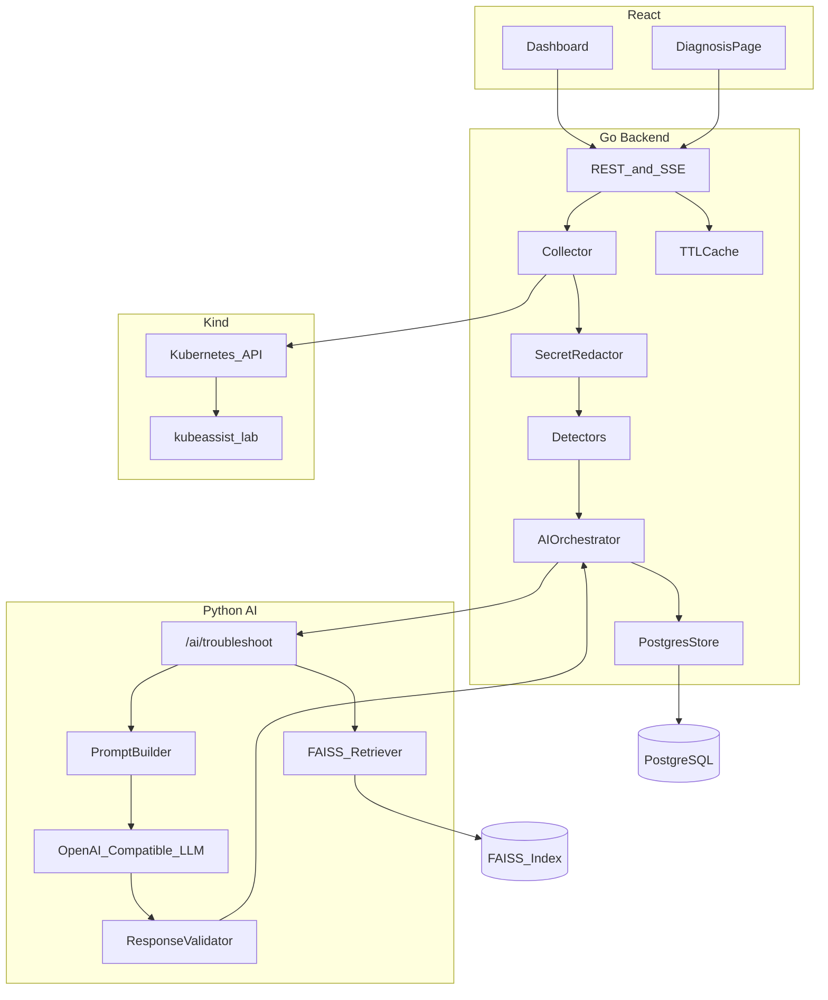
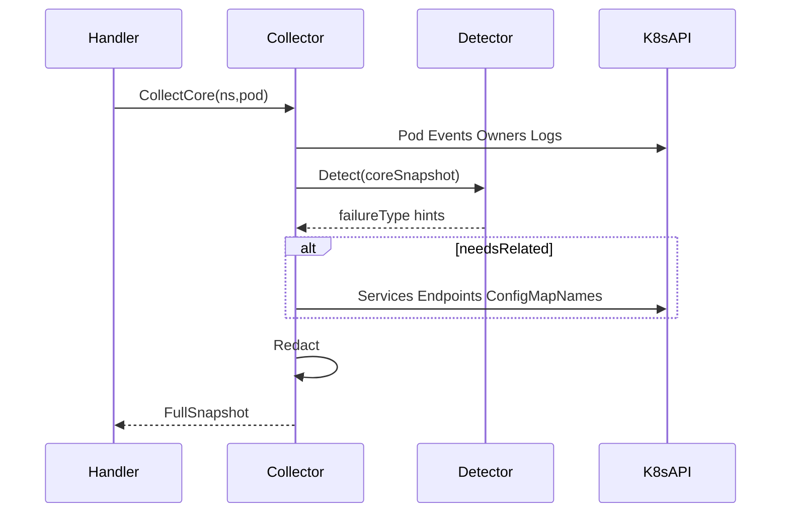

# KubeAssist AI — Technical Implementation Plan

## Architect verdict

Your high-level design is **sound** for a student MVP: Go owns Kubernetes (read-only), Python owns RAG/LLM, React presents results, Kind lab is the golden eval set. The critical correctness rule is already right: **evidence first, docs second, LLM explains — never invents.**

**Weak spots to fix before coding:**

1. **Phase order in your brief puts AI (Phase 4) before docs/FAISS (Phase 5).** A troubleshoot endpoint without an index is a dead end. Merge into: Lab → Go snapshot → Detectors → Docs index → AI+RAG → Frontend → Integration → Eval.
2. **“Intelligent collector” must be two-pass, not a giant always-fetch.** Always collect a **core snapshot**; expand (Services/Endpoints, owner YAML, previous logs) only when detectors or user context require it. Ingress / NetworkPolicy are **out of MVP** unless a golden case needs them (none of your current lab YAMLs do).
3. **Do not let the LLM classify failure type.** Go detectors set `failureType` + `searchTerms`; the LLM only explains and writes remediation grounded in evidence + retrieved docs.
4. **LangChain: use narrowly** (loaders/splitters optional). Prefer FastAPI + OpenAI-compatible SDK + your own prompt/validator. Agents/chains add opacity without portfolio value.
5. **Streaming:** SSE for **pipeline stage progress** (`collecting` → `detecting` → `retrieving` → `diagnosing` → `done`). Full structured JSON at the end. Token streaming is optional polish, not MVP-critical.
6. **Postgres stays** (investigation history for demos). **No Redis/Kafka.** In-process TTL cache in Go for list pods / snapshot is enough.

---

## 1. Final architecture



**Trust boundary:** Only Go holds kubeconfig. Python receives a **redacted DiagnosticSnapshot JSON**. Never kube credentials, never Secret/data values.

**Read-only contract:** Go ServiceAccount/kubeconfig user has `get/list/watch` only. UI copy-pastes kubectl; nothing executes apply/delete/exec.

---

## 2. Target folder structure

```
Kubernetes-assistant/
├── README.md
├── docker-compose.yml              # postgres + ai-service (+ optional go)
├── docs/
│   ├── PROJECT_STATUS.md           # existing
│   ├── ARCHITECTURE.md             # this plan distilled
│   ├── API.md                      # OpenAPI summary
│   └── golden/                     # Phase 1 output
│       ├── crashloop.json
│       ├── oom.json
│       └── ...
├── k8s/
│   ├── lab/                        # DONE — 8 manifests
│   └── rbac/                       # read-only ClusterRole + binding
├── backend-go/
│   ├── cmd/server/main.go
│   ├── go.mod
│   ├── internal/
│   │   ├── config/
│   │   ├── api/                    # HTTP handlers, middleware
│   │   ├── k8s/                    # client factory
│   │   ├── collector/              # snapshot builders
│   │   ├── detect/                 # failure detectors
│   │   ├── redact/                 # secret/token masking
│   │   ├── ai/                     # HTTP client to Python
│   │   ├── store/                  # postgres
│   │   └── model/                  # shared DTOs
│   └── internal/..._test.go
├── ai-service/
│   ├── pyproject.toml / requirements.txt
│   ├── app/
│   │   ├── main.py
│   │   ├── api/routes.py
│   │   ├── schemas.py              # Pydantic = diagnosis contract
│   │   ├── pipeline/
│   │   │   ├── troubleshoot.py
│   │   │   ├── prompt.py
│   │   │   ├── formatter.py
│   │   │   ├── validator.py
│   │   │   └── confidence.py
│   │   ├── rag/
│   │   │   ├── retrieve.py
│   │   │   ├── context.py
│   │   │   └── citations.py
│   │   └── llm/client.py
│   ├── scripts/
│   │   ├── ingest_docs.py
│   │   └── build_index.py
│   └── data/
│       ├── raw_docs/               # gitignored or sparse
│       └── faiss/                  # index + metadata pickle/json
├── frontend/
│   ├── package.json
│   ├── src/
│   │   ├── pages/
│   │   ├── components/
│   │   ├── api/
│   │   └── types/
│   └── ...
└── schemas/
    └── diagnosis.schema.json       # shared contract Go ↔ Python ↔ FE
```

---

## 3. Internal data models (core contracts)

### DiagnosticSnapshot (Go → Python)

- `cluster`: `{ name, serverVersion }`
- `pod`: name, namespace, phase, nodeName, ownerRefs, labels, annotations (scrubbed)
- `containers[]`: name, image, ready, restartCount, state (waiting/terminated reasons + messages), lastState, resources requests/limits, probes (liveness/readiness/startup summaries)
- `conditions[]`: type, status, reason, message
- `events[]`: type, reason, message, count, lastTimestamp (capped, e.g. 30)
- `logs`: `{ current: truncated string, previous: optional truncated }`
- `owners`: ReplicaSet + Deployment summaries (name, replicas, strategy) + sanitized YAML excerpts
- `related` (conditional): Services matching labels, EndpointSlices/Endpoints counts, referenced ConfigMap/Secret **names only** (keys listed, values never)
- `detector`: `{ failureType, confidence, evidence[], searchTerms[], relatedHints[] }`
- `userQuestion`: string
- `collectedAt`: RFC3339

### DiagnosisResponse (Python → Go → UI)

Matches your required output:

| Field | Purpose |
| --- | --- |
| `issueSummary` | One-paragraph SRE-style summary |
| `observedEvidence` | Bullet list **only** from snapshot (quoted/paraphrased with source pointers) |
| `probableRootCause` | Single cause hypothesis |
| `reasoning` | Why evidence supports cause |
| `confidenceScore` | 0.0–1.0 hybrid score |
| `resolutionSteps[]` | Ordered, actionable, non-executing |
| `verificationCommands[]` | kubectl read-only preferred; write cmds clearly labeled “manual” |
| `rollbackGuidance` | How to undo suggested change |
| `documentationReferences[]` | `{ title, url, section, snippet }` |
| `uncertaintyNotes` | Explicit gaps (“previous logs unavailable”) |
| `failureType` | Echo detector type (must match or explain mismatch) |

**Invariant:** Validator rejects responses that cite evidence IDs/phrases not present in the snapshot, or docs URLs not in retrieval results.

---

## 4. API design

### Go public API

| Method | Path | Role |
| --- | --- | --- |
| GET | `/api/health` | Liveness |
| GET | `/api/cluster` | Context name + server version |
| GET | `/api/namespaces` | List namespaces |
| GET | `/api/pods?namespace=` | Pod summaries (phase, ready, restarts, waitingReason) |
| GET | `/api/pods/{ns}/{name}` | Core detail + recent events |
| GET | `/api/pods/{ns}/{name}/logs?container=&previous=` | Truncated logs |
| POST | `/api/pods/{ns}/{name}/troubleshoot` | Body: `{ question? }` → full Diagnosis + investigation id |
| GET | `/api/investigations/{id}` | Saved diagnosis |
| GET | `/api/investigations?namespace=&limit=` | History |
| GET | `/api/troubleshoot/{ns}/{name}/stream` | SSE stage events then final JSON |

Optional MVP+: `POST /api/config/check` (YAML paste → AI config checker).

### Python internal API (Go-only; not public)

| Method | Path | Role |
| --- | --- | --- |
| GET | `/health` | Ready (index loaded?) |
| POST | `/ai/troubleshoot` | Snapshot in → Diagnosis out |
| POST | `/ai/summarize-logs` | Optional |
| POST | `/ai/doc-search` | Optional debug/UI |

Auth between Go↔Python: shared static token header in docker-compose (enough for local MVP).

**Timeouts:** Go→K8s 5–10s per call; Go→AI 60–90s; LLM 45s; overall troubleshoot 120s with clear client error.

**Retries:** Idempotent K8s GETs: 1–2 retries. LLM: 1 retry on 429/5xx. No retry storm.

---

## 5. Go package responsibilities

| Package | Responsibility |
| --- | --- |
| `k8s` | Build clientset from kubeconfig/`KUBECONFIG`, context `kind-kubeassist-dev` |
| `collector` | Two-pass gather; log truncation (e.g. 200 lines / 32KB); previous logs iff `restartCount > 0` |
| `detect` | Pure functions: Snapshot → DetectionResult; no network |
| `redact` | Strip Secret values, bearer tokens, PEM blocks, `password=` patterns from logs/events/YAML |
| `ai` | Marshal snapshot, call Python, map errors |
| `store` | Persist investigations |
| `api` | Validation, SSE, error envelopes `{ code, message }` |

### Detector set (maps 1:1 to lab)

- `ImagePullBackOff` / `ErrImagePull`
- `OOMKilled`
- `CrashLoopBackOff` (app exit vs probe-induced — use events `Unhealthy` + probe config)
- `ProbeFailure` (liveness killing slow start)
- `CreateContainerConfigError` / missing ConfigMap-Secret
- `FailedScheduling`
- `ServiceSelectorMismatch` (pod Running + Service with 0 endpoints / wrong selector) — needs related Service fetch
- `Healthy` / `Unknown`

**Service mismatch:** Your [`service-selector-failure.yaml`](k8s/lab/service-selector-failure.yaml) has a healthy Deployment (`service-demo`) and Service `broken-service` with `app: wrong-label`. Collector pass-2: list Services in namespace, match by intended app name or ask UI to pass `serviceName`; compare selectors to Endpoints.

### Intelligent collection algorithm



---

## 6. AI / RAG design

### Pipeline stages

1. **EvidenceFormatter** — compact, labeled sections (STATUS / EVENTS / LOGS / DETECTOR)
2. **Retriever** — query = `searchTerms` + failureType + optional user question; top-k = 4–6
3. **ContextBuilder** — cap total doc tokens (~3–4k); include metadata (title, URL, version)
4. **PromptBuilder** — system: SRE, evidence-only, refuse invention; user: question + evidence + docs
5. **LLM** — JSON mode / schema-constrained if provider supports
6. **ResponseValidator** — schema + evidence grounding checks + citation allowlist
7. **ConfidenceScorer** — `0.5*detectorConf + 0.3*retrievalScore + 0.2*llmSelfScore`; cap low if logs empty or Unknown type
8. **CitationBuilder** — only retrieved chunks
9. **ResponseFormatter** — DiagnosisResponse

### RAG parameters (MVP defaults)

| Setting | Value | Rationale |
| --- | --- | --- |
| Chunk size | ~800–1000 tokens | Enough for a doc subsection |
| Overlap | ~100–150 tokens | Preserve probe/command continuity |
| Embeddings | `text-embedding-3-small` (or compatible) | Cheap, good enough |
| Store | FAISS IndexFlatIP + normalized vectors | Simple, local, zero ops |
| Metadata | `title, url, section, k8s_version, doc_type` | Citations + version filter |
| Version filter | Prefer chunks matching `serverVersion` major.minor; fallback to “latest stable” set | Avoid wrong-version advice |
| Update | Rebuild index via `scripts/build_index.py`; commit or CI artifact `data/faiss/` | No live crawl in MVP |
| Docs corpus | Curated subset: Pods, Deployments, Probes, Resources/OOM, Images, ConfigMaps/Secrets, Scheduling, Services/Endpoints | Matches lab; full k8s.io is too large |

**Why FAISS:** Zero infrastructure, fast local ANN, standard for portfolio RAG demos. Not for multi-tenant prod — fine here.

**Anti-hallucination prompt rules:** If snapshot lacks X, say so; every evidence bullet must map to a field; never invent log lines; commands are suggestions only.

---

## 7. Frontend (Phase: after Go can serve pods + diagnose)

Pages/components:

- **Cluster bar:** context name, version, connection error
- **Namespace select + pod table:** search, phase badges, restart count, waiting reason
- **Diagnosis page:** question input, Run diagnosis, SSE progress, result sections matching DiagnosisResponse
- **Evidence panel:** events + detector evidence (collapsible)
- **Logs panel:** current/previous tabs, copy
- **Recommendations:** numbered steps + copy kubectl
- Loading / empty / error states
- Dark mode: CSS variables only if time; not blocking

Stack: Vite + React + TypeScript + Tailwind (matches existing roadmap).

---

## 8. Phased implementation (do not skip)

### Phase 1 — Kind verification + golden notes
- **Goal:** Prove each lab scenario produces stable, documentable evidence.
- **Deliverables:** `docs/golden/*.json` with expected `failureType`, key event reasons, sample log snippets, fix outline; short verification checklist in README.
- **Acceptance:** All 8 applied; `kubectl get/describe/logs` match notes; one manual fix recovers a scenario.
- **Complexity:** Low | **Risk:** Flaky timing (ImagePull/OOM) — document wait times | **Test:** Manual checklist

### Phase 2 — Go project + diagnostic snapshot
- **Goal:** Read-only client-go collector + REST pod APIs.
- **Deliverables:** `backend-go/` with health, list/get pods, snapshot endpoint (internal or debug), redaction, RBAC manifests.
- **Acceptance:** Against Kind lab, snapshot JSON includes waiting reason, restarts, events, logs, owner for CrashLoop and ImagePull.
- **Complexity:** Med | **Risk:** client-go version skew — pin to Kind’s server version | **Test:** `httptest` + Kind integration test tagged `integration`

### Phase 3 — Issue detectors
- **Goal:** Deterministic classification without LLM.
- **Deliverables:** `internal/detect` + unit tests from golden fixtures (replay JSON, no cluster).
- **Acceptance:** ≥7/8 lab types classified correctly from recorded snapshots; Healthy → Healthy.
- **Complexity:** Med | **Risk:** CrashLoop vs Probe overlap — prefer Probe when Unhealthy events + probe present | **Test:** Table-driven golden tests

### Phase 4 — Documentation ingestion + FAISS
- **Goal:** Offline index with citations metadata.
- **Deliverables:** ingest/build scripts, `data/faiss/`, retrieval smoke tests per failureType.
- **Acceptance:** Query “liveness probe CrashLoop” returns probe docs; ImagePull query returns image pull docs.
- **Complexity:** Med | **Risk:** Copyright/size — use curated pages + LICENSE note | **Test:** Retrieval precision@k on fixed queries

### Phase 5 — Python AI service + RAG pipeline
- **Goal:** `/ai/troubleshoot` returns validated DiagnosisResponse.
- **Deliverables:** FastAPI app, prompt, validator, confidence, OpenAI-compatible client.
- **Acceptance:** For 3 golden snapshots (CrashLoop, OOM, ImagePull), schema-valid output with real citations and no fabricated evidence.
- **Complexity:** Med-High | **Risk:** LLM drift — schema + validator mandatory | **Test:** Snapshot fixtures + mocked LLM + 1 live smoke

### Phase 6 — React frontend
- **Goal:** Usable demo UI on live Kind data.
- **Deliverables:** Dashboard, pod detail, diagnosis page with evidence/logs/steps.
- **Acceptance:** Select failing pod → see diagnosis sections; copy commands works.
- **Complexity:** Med | **Risk:** Over-designed UI — keep one composition, functional first | **Test:** Component tests for render states; manual E2E

### Phase 7 — Integration (Go ↔ Python ↔ React ↔ Postgres)
- **Goal:** End-to-end troubleshoot + history + SSE stages.
- **Deliverables:** Orchestrator, docker-compose, env sample, investigation persistence.
- **Acceptance:** One click from UI through saved investigation for CrashLoop and Service mismatch.
- **Complexity:** Med | **Risk:** CORS, timeouts, compose networking | **Test:** compose smoke script

### Phase 8 — Evaluation + portfolio polish
- **Goal:** Measurable quality + demo script.
- **Deliverables:** Golden eval harness (detector accuracy, citation presence, latency p50/p95), demo README, architecture diagram.
- **Acceptance:** Detectors ≥90% on lab; diagnoses demoable in &lt;90s; README “5-minute demo”.
- **Complexity:** Low-Med | **Risk:** LLM cost/flakes — cache golden LLM responses for CI | **Test:** CI runs detectors + mocked AI; live eval manual/nightly

*(Your original Phase numbers 4–9 are preserved in spirit; docs index is deliberately before AI.)*

---

## 9. System design considerations (MVP-appropriate)

| Concern | Decision |
| --- | --- |
| Caching | Go in-memory TTL 5–15s for pod list; no cache for troubleshoot (fresh evidence) |
| Concurrency | `errgroup` for parallel Pod+Events+Logs; limit log fetch workers |
| Config | Env vars: `KUBECONFIG`, `AI_BASE_URL`, `DATABASE_URL`, `LLM_API_KEY`, timeouts |
| DI | Go: constructors in `main`; Python: FastAPI lifespan loads FAISS once |
| Logging | Structured JSON logs; request ID; never log full secrets |
| Observability | Request latency metrics optional; at minimum timed stages in SSE + logs |
| Scalability | Single replica each service; FAISS in-process — OK for demo, document limit |
| Version compat | client-go ≈ Kind version; doc filter by serverVersion |
| Failure handling | Partial snapshot still diagnosable; mark missing sections explicitly |

---

## 10. Security

- RBAC: `get/list/watch` on pods, events, apps/*, services, endpoints/endpointslice, nodes, namespaces, configmaps (optional). **Avoid Secret get**; if needed for “missing secret” detection, fetch metadata only or detect from events without values.
- Redact before AI and before FE logs view if high sensitivity (MVP: redact AI path always; FE shows cluster logs as kubectl would for local Kind).
- AI commands never executed; UI labels “Copy — run manually”.
- No SSRF: Python not given arbitrary URLs to fetch.

---

## 11. Tradeoffs and better alternatives considered

| Choice | Alternative | Why this MVP |
| --- | --- | --- |
| Go + Python split | All Python | client-go + typed detectors are stronger interview story |
| FAISS local | pgvector | Less infra; Postgres already for history only |
| Detectors in Go | LLM classification | Correctness / anti-hallucination |
| SSE stages | Token stream only | Better UX for long RAG calls |
| Curated docs | Full kubernetes crawl | Scope + license + quality |
| Postgres | SQLite | Compose demo of “real” persistence; SQLite fine if you later simplify |

**Do not add:** operators, agents with tools that shell out, multi-cluster federation, Prometheus — dilutes MVP.

---

## 12. Missing requirements (call out now)

- Shared JSON Schema in [`schemas/diagnosis.schema.json`](schemas/diagnosis.schema.json)
- RBAC YAML under `k8s/rbac/`
- Log/event size caps and previous-log policy
- Explicit handling when pod is Pending vs Running
- Service troubleshooting entrypoint (pod-centric UI needs “related Services” or diagnose-by-Service)
- LLM cost controls / offline mock mode for demos without API key
- LICENSE note for ingested Kubernetes docs
- `.env.example` and “works without LLM” path (detectors-only diagnosis stub) for graders

---

## 13. Portfolio / interview upgrades (realistic)

1. Golden detector tests with committed snapshot fixtures (shows engineering maturity).
2. Architecture diagram + threat model paragraph (read-only, redaction).
3. Side-by-side: **detector-only** vs **full RAG diagnosis** in UI.
4. One-page “failure taxonomy” matching the lab.
5. Demo script: break → diagnose → show citations → manual fix → re-diagnose Healthy.

---

## 14. Immediate next action (this week)

1. Finish Phase 1: apply all of [`k8s/lab/`](k8s/lab/), write `docs/golden/*.json`.
2. Scaffold `backend-go` module, connect to Kind, implement `ListPods` + waiting reason/restarts.
3. Do **not** start React or LLM until snapshot + one detector (CrashLoop) work end-to-end in Go.

---

## Definition of done (MVP)

- Kind lab loads; UI lists pods with real waiting reasons
- Troubleshoot returns all required diagnosis fields with citations
- Detectors cover all 8 lab scenarios
- No auto-apply; secrets redacted from AI payload
- README: Kind up → compose up → demo path &lt; 10 minutes
