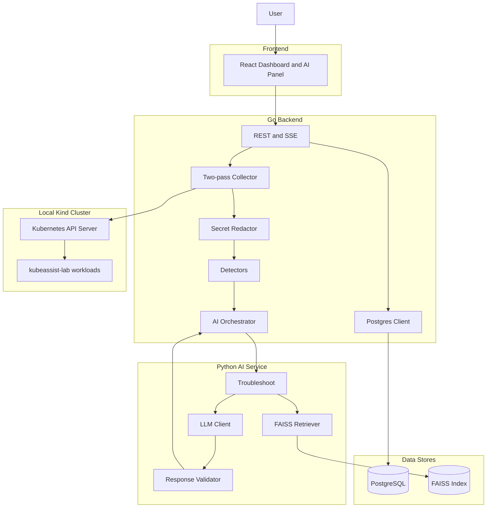
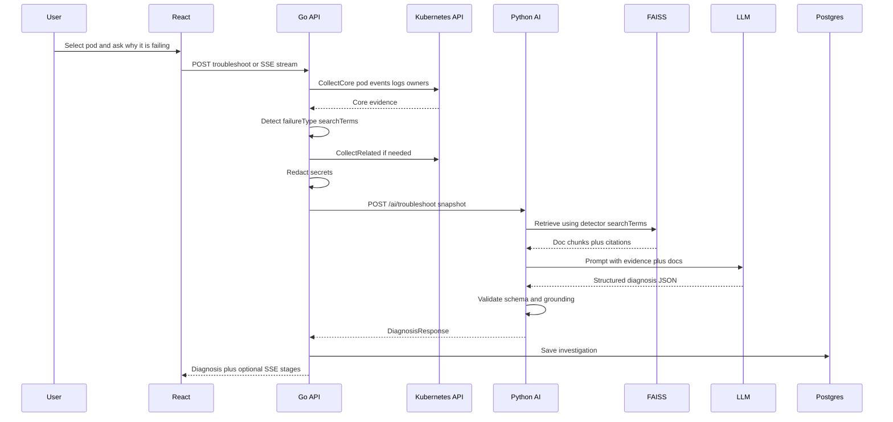

# KubeAssist AI — Project Status & Roadmap

Detailed overview of what the project is, how much is done, what comes next, and how the system fits together.

**Architecture decisions (weak spots fixed):** → [ARCHITECTURE.md](ARCHITECTURE.md)  
**Why we chose X:** → [decision.md](decision.md)  
**Progress log:** → [projectprogress.md](projectprogress.md)  
**Shared contracts:** → [`schemas/`](../schemas/)  
**Golden notes:** → [`docs/golden/`](golden/)  
**RAG corpus prep:** → [`docs/rag/CORPUS.md`](rag/CORPUS.md)

---

## 1. Project overview

**KubeAssist AI** is a student-scope web application that helps developers troubleshoot Kubernetes issues using AI.

Users select a pod (or ask a question). The Go backend gathers live cluster evidence (status, events, logs, YAML) and runs **deterministic detectors**. The Python AI service retrieves related Kubernetes documentation with RAG (FAISS) and uses an LLM to return a structured diagnosis. The LLM **explains**; it does **not** classify failure type.

The goal is **not** full SRE automation. The app recommends fixes; it does **not** auto-apply changes to the cluster.

### MVP scope

Pods, Deployments, Services, Events, Logs, YAML config checker, documentation Q&A, log summarization.

### Out of scope (MVP)

Multi-cluster, autonomous remediation, Prometheus/Loki, message queues, Redis, Kafka, Kubernetes operators, multi-tenant SaaS, Ingress/NetworkPolicy collection (unless a golden case requires it).

---

## 2. Tech stack

| Layer | Technology |
| --- | --- |
| Frontend | React, TypeScript, Tailwind CSS |
| Backend API | Go + client-go |
| Detectors | Go (deterministic; no LLM) |
| AI service | Python FastAPI, OpenAI-compatible LLM |
| RAG | FAISS + curated kubernetes.io docs |
| LangChain | Optional loaders/splitters only — no agents |
| Database | PostgreSQL (investigation history only) |
| Cache | Go in-process TTL (pod list) — no Redis |
| Local cluster lab | Kind, kubectl, Docker |

---

## 3. Architecture

See [ARCHITECTURE.md](ARCHITECTURE.md) for trust boundaries, two-pass collector, caps, and streaming rules.



**Design rules:**

- Only Go talks to the Kubernetes API.
- Python receives a redacted `DiagnosticSnapshot` (see schemas).
- Detectors set `failureType` + `searchTerms` in Go; AI must not reclassify.

---

## 4. End-to-end troubleshooting flow



### Numbered steps

1. User selects a pod in React (optional `serviceName` for Service issues).  
2. React calls Go troubleshoot (JSON or SSE stages: collecting → detecting → retrieving → diagnosing → done).  
3. Go **pass 1** collects core evidence; **detectors** classify; **pass 2** expands related resources if needed.  
4. Go redacts and sends `DiagnosticSnapshot` to Python.  
5. Python retrieves docs with `searchTerms`, prompts LLM, validates JSON (no invented evidence).  
6. Go saves investigation in PostgreSQL.  
7. UI shows full diagnosis fields including citations and uncertainty notes.

---

## 5. Progress so far

**Overall MVP completion: ~20%** (planning + lab fixtures + contracts + golden notes + RBAC). Application services: **not started**.

| Area | Status | Notes |
| --- | --- | --- |
| Project idea / scope | Done | Student MVP locked |
| System design / weak spots | Done | [ARCHITECTURE.md](ARCHITECTURE.md) |
| Shared JSON schemas | Done | [`schemas/`](../schemas/) |
| Phase 1 lab manifests | Done | 8 YAMLs; `missing-config-app` Deployment fixed |
| Phase 1 golden notes | Done | [`docs/golden/`](golden/) expected signals |
| Phase 1 Kind verify | Partial | Apply lab and confirm against goldens |
| RBAC read-only | Done | [`k8s/rbac/`](../k8s/rbac/) |
| RAG corpus list + license note | Done | [`docs/rag/`](rag/) — ingest not started |
| Env template | Done | [`.env.example`](../.env.example) |
| Phase 2 Go collector | Not started | — |
| Phase 3 detectors | Not started | — |
| Phase 4 FAISS ingest | Not started | Ready to start after Kind verify |
| Phase 5 AI + RAG pipeline | Not started | Can use schemas + golden fixtures |
| Phase 6 React | Not started | — |
| Phase 7 Integration | Not started | — |
| Phase 8 Eval / polish | Not started | — |

### Repo today

```
Kubernetes-assistant/
├── .env.example
├── k8s/
│   ├── lab/                 # 8 failure manifests
│   └── rbac/                # read-only collector RBAC
├── schemas/                 # snapshot + diagnosis contracts
├── docs/
│   ├── PROJECT_STATUS.md
│   ├── ARCHITECTURE.md
│   ├── golden/              # expected signals per scenario
│   └── rag/                 # corpus list + docs license note
└── README.md
```

---

## 6. Lab failure reference

| Scenario | File | failureType | Meaning | Typical fix |
| --- | --- | --- | --- | --- |
| Healthy baseline | `healthy-app.yaml` | Healthy | Control sample | — |
| App crash loop | `crashloop-app.yaml` | CrashLoopBackOff | Process exits with error | Fix app/config so process does not exit |
| Probe too early | `probe-failure-app.yaml` | ProbeFailure | Liveness kills slow-starting app | Add `startupProbe` or increase delay |
| Bad image | `image-pull-failure.yaml` | ImagePullBackOff | Image cannot be pulled | Fix image name / registry / auth |
| Memory kill | `oom-failure.yaml` | OOMKilled | Exceeded memory limit | Raise limit or reduce usage |
| Missing config key | `missing-config-app.yaml` | CreateContainerConfigError | ConfigMap key missing | Add key or fix env ref |
| Cannot schedule | `scheduling-failure.yaml` | FailedScheduling | Requests too large | Lower resource requests |
| Bad Service | `service-selector-failure.yaml` | ServiceSelectorMismatch | Pod OK, no endpoints | Align Service selector with pod labels |

---

## 7. Phase roadmap (corrected order)

```
Phase 1 Lab + goldens
  -> Phase 2 Go Collector (two-pass + redact)
  -> Phase 3 Detectors (Go; no LLM)
  -> Phase 4 Docs ingest + FAISS
  -> Phase 5 Python AI + RAG troubleshoot
  -> Phase 6 React frontend
  -> Phase 7 Integration (Postgres + SSE)
  -> Phase 8 Eval + polish
```

| Phase | Focus | Exit criteria |
| --- | --- | --- |
| 1 | Failure lab + golden notes | Manifests + goldens done; Kind verify recommended |
| 2 | Go collector | Snapshot JSON + redaction + pod APIs |
| 3 | Detectors | Snapshot → failureType without LLM; golden unit tests |
| 4 | FAISS index | Retrieval smoke tests per failureType |
| 5 | AI service | Validated DiagnosisResponse from fixtures/live snapshots |
| 6 | React UI | Dashboard, evidence, diagnosis page |
| 7 | Integration | E2E troubleshoot + history + SSE stages |
| 8 | Eval / polish | Detector accuracy, demo README |

**Parallel track:** After Phase 1 contracts, AI/RAG (4–5) may proceed on fixtures while Go (2–3) is built by another owner — **do not change schemas unilaterally.**

**Total:** about 6–8 weeks of part-time work.

---

## 8. Immediate next actions

### A. Finish Kind verification (recommended before coding)

```powershell
kubectl config use-context kind-kubeassist-dev
kubectl create namespace kubeassist-lab
kubectl apply -f .\k8s\lab\
kubectl apply -f .\k8s\rbac\
kubectl get pods -n kubeassist-lab
```

Confirm each scenario against [`docs/golden/`](golden/).

### B. If implementing RAG next (without Go)

1. Keep [`schemas/`](../schemas/) stable.  
2. Follow [`docs/rag/CORPUS.md`](rag/CORPUS.md) for ingest.  
3. Build FAISS + retrieval smoke tests using golden `searchTerms`.  
4. Use mock `DiagnosticSnapshot` fixtures (detector pre-filled) for `/ai/troubleshoot`.  
5. Support `LLM_MOCK=true` from [`.env.example`](../.env.example).

### C. If implementing Go next (separate owner)

- Two-pass collector, redaction, detectors, RBAC SA — see [ARCHITECTURE.md](ARCHITECTURE.md).  
- Do not start React until snapshot + at least one detector work.

---

## 9. MVP definition of done

- [ ] Dashboard shows pods from the Kind cluster  
- [ ] Selecting a pod shows events, logs, and YAML  
- [ ] Troubleshoot returns all diagnosis schema fields with citations  
- [ ] Detectors cover all 8 lab scenarios; LLM does not reclassify  
- [ ] Secrets redacted; read-only RBAC; no auto-apply  
- [ ] README explains setup and a demo path  

---

## 10. Feature map vs phases

| Feature | Relies on phases |
| --- | --- |
| Cluster dashboard | 2, 6 |
| Pod details | 2, 6 |
| AI troubleshooting | 2–5, 6–7 |
| Doc search / RAG | 4–5, 6 |
| Log summarization | 2, 5, 6 |
| Investigation history | 7, 6 |
| Service mismatch diagnose | 2 (pass-2), 3, 5, 6 |
