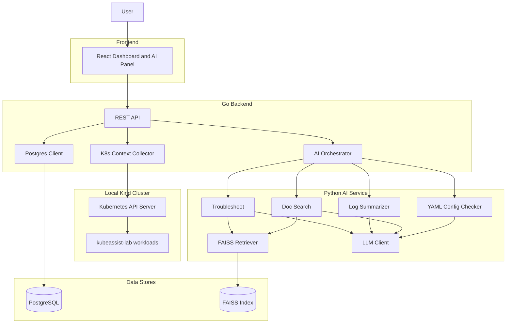
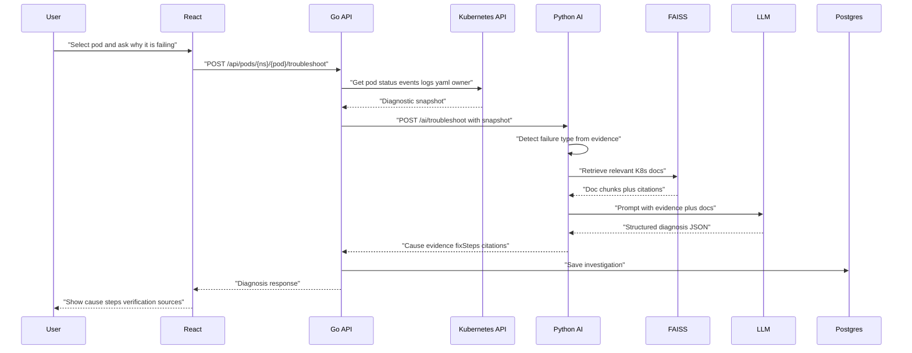

```mermaid
flowchart LR
  P1["Phase 1 Lab"]
  P2["Phase 2 Go Collector"]
  P3["Phase 3 Detectors"]
  P4["Phase 4 RAG Index"]
  P5["Phase 5 AI Service"]
  P6["Phase 6 Prompts"]
  P7["Phase 7 Integration"]
  P8["Phase 8 Frontend"]
  P9["Phase 9 Eval Polish"]

  P1 --> P2
  P2 --> P3
  P3 --> P4
  P4 --> P5
  P5 --> P6
  P6 --> P7
  P7 --> P8
  P8 --> P9
```

# KubeAssist AI — Project Status & Roadmap

Detailed overview of what the project is, how much is done, what comes next, and how the system fits together.

---

## 1. Project overview

**KubeAssist AI** is a student-scope web application that helps developers troubleshoot Kubernetes issues using AI.

Users select a pod (or ask a question). The Go backend gathers live cluster evidence (status, events, logs, YAML). The Python AI service retrieves related Kubernetes documentation with RAG (FAISS) and uses an LLM to return:

- Observed failure / status  
- Supporting evidence  
- Likely cause  
- Ordered fix steps  
- Verification commands  
- Documentation citations  

The goal is **not** full SRE automation. The app recommends fixes; it does **not** auto-apply changes to the cluster.

### MVP scope

Pods, Deployments, Services, Events, Logs, YAML config checker, documentation Q&A, log summarization.

### Out of scope (MVP)

Multi-cluster, autonomous remediation, Prometheus/Loki, message queues, multi-tenant SaaS.

---

## 2. Tech stack

| Layer | Technology |
| --- | --- |
| Frontend | React, TypeScript, Tailwind CSS |
| Backend API | Go + client-go |
| AI service | Python, RAG, LLM |
| Vector store | FAISS |
| Database | PostgreSQL |
| Local cluster lab | Kind, kubectl, Docker |

---

## 3. Architecture

### Mermaid



### ASCII fallback

```
User
  |
  v
React Frontend  (dashboard, pod details, AI panel)
  |
  v
Go Backend API
  |-- reads cluster --> Kubernetes API --> Kind lab pods
  |-- stores history --> PostgreSQL
  |
  v
Python AI Service
  |-- retrieves docs --> FAISS
  |-- reasons --> LLM
  |
  v
Structured answer back to the UI
```

**Design rule:** Only the Go backend talks to the Kubernetes API. The Python AI service receives a diagnostic snapshot and does not hold kubeconfig credentials.

---

## 4. End-to-end troubleshooting flow

### Mermaid



### Numbered steps (always readable)

1. User selects a pod in React and asks why it is failing.  
2. React calls Go: `POST /api/pods/{ns}/{pod}/troubleshoot`.  
3. Go collects from Kubernetes: pod status/restarts, events, current + previous logs, YAML / owner Deployment.  
4. Go sends that snapshot to the Python AI service.  
5. Python detects failure type, retrieves matching docs from FAISS, and asks the LLM for a structured diagnosis.  
6. Go saves the investigation in PostgreSQL.  
7. UI shows status, evidence, likely cause, fix steps, verification commands, and citations.

---

## 5. Progress so far

**Overall MVP completion: ~10–15%** (planning + lab fixtures). Application services: **not started**.

| Area | Status | Notes |
| --- | --- | --- |
| Project idea / scope | Done | Student MVP locked |
| System design | Done | Architecture and phases defined |
| Phase 1 lab manifests | Done | All 8 YAML files under `k8s/lab/` |
| Phase 1 cluster verification | Partial | Apply and inspect every scenario on Kind |
| Phase 2 Go collector | Not started | No Go code yet |
| Phase 3 failure detectors | Not started | — |
| Phase 4 FAISS docs index | Not started | — |
| Phase 5 Python AI service | Not started | — |
| Phase 6 prompts / JSON schema | Not started | — |
| Phase 7 Go + AI + Postgres | Not started | — |
| Phase 8 React UI | Not started | — |
| Phase 9 evaluation / polish | Not started | — |

### Repo today

```
Kubernetes-assistant/
├── k8s/lab/
│   ├── healthy-app.yaml
│   ├── crashloop-app.yaml
│   ├── probe-failure-app.yaml
│   ├── image-pull-failure.yaml
│   ├── oom-failure.yaml
│   ├── missing-config-app.yaml
│   ├── scheduling-failure.yaml
│   └── service-selector-failure.yaml
├── docs/
│   └── PROJECT_STATUS.md
└── README.md
```

### Phase completion snapshot

| Phase | Progress |
| --- | --- |
| 1 Lab + manifests | ~80% (files done; finish verification) |
| 2–9 Application work | 0% |

---

## 6. Lab failure reference

Intentional broken workloads for learning and later AI evaluation.

| Scenario | File | Failure type | Meaning | Typical fix |
| --- | --- | --- | --- | --- |
| Healthy baseline | `healthy-app.yaml` | None | Control sample | — |
| App crash loop | `crashloop-app.yaml` | CrashLoopBackOff | Process exits with error | Fix app/config so process does not exit |
| Probe too early | `probe-failure-app.yaml` | Probe → CrashLoop | Liveness kills slow-starting app | Add `startupProbe` or increase delay |
| Bad image | `image-pull-failure.yaml` | ImagePullBackOff | Image cannot be pulled | Fix image name / registry / auth |
| Memory kill | `oom-failure.yaml` | OOMKilled | Exceeded memory limit | Raise limit or reduce usage |
| Missing config | `missing-config-app.yaml` | CreateContainerConfigError | ConfigMap missing | Create ConfigMap/Secret with correct keys |
| Cannot schedule | `scheduling-failure.yaml` | FailedScheduling | Requests too large | Lower resource requests |
| Bad Service | `service-selector-failure.yaml` | Selector mismatch | Pod OK, no endpoints | Align Service selector with pod labels |

---

## 7. Phase roadmap

### Mermaid



### ASCII fallback

```
Phase 1 Lab
  -> Phase 2 Go Collector
  -> Phase 3 Detectors
  -> Phase 4 RAG Index
  -> Phase 5 AI Service
  -> Phase 6 Prompts
  -> Phase 7 Integration
  -> Phase 8 Frontend
  -> Phase 9 Eval + Polish
```

### Summary table

| Phase | Focus | Est. time | Exit criteria |
| --- | --- | --- | --- |
| 1 | Failure lab on Kind | Finishing | Every scenario applied, inspected, golden notes written |
| 2 | Go + client-go collector | 1–1.5 weeks | Snapshot JSON for a pod (status, events, logs, YAML, owner) |
| 3 | Deterministic detectors | 2–4 days | Snapshot → failureType + evidence + searchTerms without LLM |
| 4 | Docs → FAISS | 3–5 days | Probe/CrashLoop queries retrieve relevant K8s docs |
| 5 | Python AI service | ~1 week | `/ai/troubleshoot` returns structured diagnosis |
| 6 | Prompt + JSON schema | 2–3 days | Validated cause, steps, citations, uncertainty |
| 7 | Go orchestrates AI + Postgres | 3–5 days | Public troubleshoot API + saved history |
| 8 | React UI | 1–1.5 weeks | Dashboard, pod details, AI panel, config checker |
| 9 | Tests + polish | ~1 week | Golden cases demoable; run instructions complete |

**Total:** about 6–8 weeks of part-time work.

### Phase details (what remains)

#### Phase 1 — Finish verification

- Apply all manifests in `k8s/lab/`
- For each pod: get, describe, events, logs / `--previous`
- Document expected evidence, cause, fix, and verification
- Manually fix one scenario and confirm recovery

#### Phase 2 — Go Kubernetes collector

- Connect via kubeconfig (`kind-kubeassist-dev`)
- List pods with real waiting reason and restart count
- Fetch events, current/previous logs, YAML, owner chain (Pod → ReplicaSet → Deployment)
- Expose REST endpoints such as `GET /api/pods` and `POST /api/investigations/context`

#### Phase 3 — Failure detectors

- Classify ImagePullBackOff, OOMKilled, FailedScheduling, probe Unhealthy, CreateContainerConfigError, app CrashLoop, Service selector mismatch from evidence

#### Phase 4 — Documentation index

- Chunk selected official Kubernetes docs
- Embed and store in FAISS with title/section/URL metadata
- Test retrieval per failure type

#### Phase 5–6 — AI service and prompts

- Endpoints: troubleshoot, summarize-logs, doc-search, check-config
- Evidence-first prompts; structured JSON; no invented facts; recommend commands only (no auto-apply)

#### Phase 7 — Integration

- `POST /api/pods/{ns}/{pod}/troubleshoot`: Go builds snapshot → Python AI → validate → Postgres → response

#### Phase 8 — Frontend

- Dashboard, pod details, AI investigation panel, YAML checker, history

#### Phase 9 — Evaluation and polish

- Golden tests for all lab failures; docker-compose; demo script

---

## 8. Immediate next actions

### 1. Finish Phase 1 verification

```powershell
kubectl config use-context kind-kubeassist-dev
kubectl create namespace kubeassist-lab
kubectl apply -f .\k8s\lab\
kubectl get pods -n kubeassist-lab
```

Inspect each failure and write golden diagnosis notes.

### 2. Start Phase 2

- Initialize a Go module
- Connect to Kind with client-go
- Implement `ListPods` and print waiting reason / restart count

Do **not** start React or the LLM until Go can return a solid diagnostic snapshot.

---

## 9. MVP definition of done

The project is complete when:

- [ ] Dashboard shows pods from the Kind cluster
- [ ] Selecting a pod shows events, logs, and YAML
- [ ] Asking why a pod is failing returns observed status, evidence, likely cause, ordered fix steps, verification commands, and doc citations
- [ ] Documentation search and YAML config checker work
- [ ] At least CrashLoop, ImagePull, OOM, probe failure, and missing ConfigMap are demoable
- [ ] README explains setup and a demo path

---

## 10. Feature map vs phases

| Feature | Relies on phases |
| --- | --- |
| Cluster dashboard | 2, 8 |
| Pod details | 2, 8 |
| AI troubleshooting | 2–7, 8 |
| Doc search | 4–6, 8 |
| Log summarization | 2, 5, 8 |
| YAML config checker | 5–6, 8 |
| Investigation history | 7, 8 |

---

## 11. Target repo structure (future)

```
Kubernetes-assistant/
├── k8s/lab/            # Done — failure manifests
├── backend-go/         # Phase 2+
├── ai-service/         # Phase 4–6
├── frontend/           # Phase 8
├── docs/               # Status + golden cases
├── docker-compose.yml  # Phase 7/9
└── README.md
```
