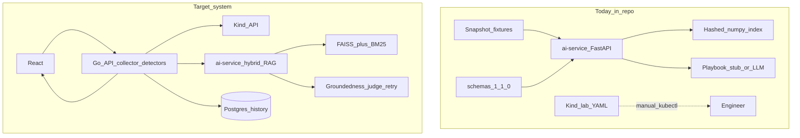
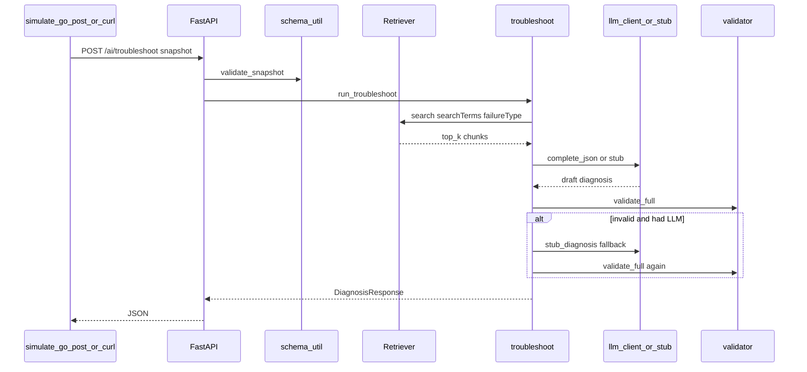
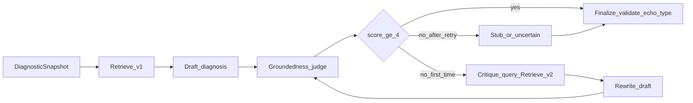

# KubeAssist — System Status and Roadmap

> **Purpose:** One place that answers three questions honestly: **what exists in the repo today**, **how that tech works**, and **what to build next** (including an agentic RAG groundedness loop).  
> **Source of truth for “current”:** files on disk (especially `ai-service/`, `schemas/`, `k8s/`, `docs/decision.md`, `docs/projectprogress.md`).  
> **Writing style reference:** [INTERVIEW_PREPARATION.md](../INTERVIEW_PREPARATION.md) (Say / Disclose / Follow-up clarity).  
> **Not a substitute for:** that interview doc (which describes the *product story*). This file is the *engineering reality + plan*.

**Status labels**

| Mark | Meaning |
| --- | --- |
| Done | Exists in code or committed lab/docs and works as described |
| Partial | Exists with real gaps |
| Planned | Designed in docs / this roadmap; little or no code |
| Interview-only | Described in interview prep as the target story; **not** what runs today |

---

## Table of Contents

1. [Executive snapshot](#1-executive-snapshot)
2. [What the system looks like today](#2-what-the-system-looks-like-today)
3. [Current tech deep-dive (by component)](#3-current-tech-deep-dive-by-component)
4. [Contracts and failure taxonomy on disk](#4-contracts-and-failure-taxonomy-on-disk)
5. [How a request works today (end to end)](#5-how-a-request-works-today-end-to-end)
6. [Gaps vs the finished product story](#6-gaps-vs-the-finished-product-story)
7. [Future plan — phases with detailed steps](#7-future-plan--phases-with-detailed-steps)
8. [Agentic RAG + groundedness rechecking (design)](#8-agentic-rag--groundedness-rechecking-design)
9. [Acceptance criteria and eval](#9-acceptance-criteria-and-eval)
10. [File map (current)](#10-file-map-current)
11. [How to run what exists today](#11-how-to-run-what-exists-today)

---

# 1. Executive snapshot

## 1.1 One paragraph (current)

KubeAssist today is a **Python FastAPI RAG microservice** that accepts a schema-valid `DiagnosticSnapshot` (as if Go posted it), retrieves curated Kubernetes doc excerpts using a **local hashed n-gram vector index** (NumPy files under `ai-service/data/faiss/`), and returns a schema-valid `DiagnosisResponse`. Default mode is **`LLM_MOCK=true`**: a deterministic playbook stub plus retrieved citations. Optional live OpenAI-compatible chat completions exist. Alongside that: **eight Kind lab manifests**, **read-only RBAC**, **shared JSON schemas 1.1.0**, and **golden expected-notes** (not live snapshots). There is **no Go backend, no React UI, no docker-compose, no Postgres wiring, no sentence-transformers, no FAISS library, no BM25 hybrid retrieval** in code.

## 1.2 One paragraph (future)

The finished system is: Kind lab → **Go** two-pass collector + detectors + redaction → **Python** hybrid RAG (sentence-transformers or API embeddings + FAISS/BM25) with an **agentic groundedness loop** → React dashboard + SSE → Postgres investigation history → eval harness. Detectors still **classify**; the LLM still **explains**; groundedness **judges and may retry retrieve/draft once**, but must **not** change `failureType`.

## 1.3 Visual: current vs target



---

# 2. What the system looks like today

## 2.1 Repo layout (actual)

| Path | Status | Role |
| --- | --- | --- |
| `ai-service/` | Done | Only application runtime |
| `schemas/` | Done | Go↔Python contracts (1.1.0) |
| `k8s/lab/` | Done | 8 broken/healthy workloads |
| `k8s/rbac/` | Done | Read-only collector SA + ClusterRole |
| `docs/` | Done | Architecture, decisions, plan, goldens, corpus |
| `docs/golden/` | Partial | Expected **notes**, not DiagnosticSnapshot exports |
| `.env.example` | Done | Template for future Go/AI/FE |
| `INTERVIEW_PREPARATION.md` | Done | Interview narrative (target stack) |
| `backend-go/` | Planned | Missing |
| `frontend/` | Planned | Missing |
| `docker-compose.yml` | Planned | Missing |
| Postgres / migrations | Planned | Only `DATABASE_URL` string in `.env.example` |

## 2.2 What you can demo today

1. **Kind lab** — apply YAML, `kubectl get/describe/logs`, see CrashLoop / ImagePull / OOM / etc.  
2. **AI service** — `uvicorn` + `scripts/simulate_go_post.py crashloop-app.json` → JSON diagnosis.  
3. **Swagger** — `http://127.0.0.1:8000/docs`.  
4. **Tests** — `pytest` in `ai-service` (9 cases).

You **cannot** demo: click a pod in a UI, live Kind → Go → AI in one button, SSE stages, investigation history.

## 2.3 Decision locks that still apply (from `docs/decision.md`)

| ID | Rule | Implications for roadmap |
| --- | --- | --- |
| D1 | Go classifies; Python echoes `failureType` | Agentic groundedness may **retry retrieve/draft**, never reclassify |
| D2 | Schemas are the only Go↔Python contract | Bump to 1.2 only with agreement |
| D4 | No recollect fields yet | Optional later; prefer groundedness loop **inside Python** first |
| D5 | Two-pass collector; Python JSON-only | Go owns kube; Python never gets kubeconfig |
| D6 | Hybrid confidence formula | Keep when adding judge score |
| D8 | Hashed embeddings for MVP | Swap to sentence-transformers/FAISS without changing `/ai/troubleshoot` shape |
| D9 | `LLM_MOCK` default | Keep for CI/demos |
| D11 | Validator: schema + echo + citation allowlist + evidence grounding | Becomes the base of the agentic judge |
| D13 | No Redis/Kafka; Postgres = history later | Do not add brokers for MVP |

---

# 3. Current tech deep-dive (by component)

## 3.1 FastAPI app — Done

**Files:** `ai-service/app/main.py`, `app/api/routes.py`, `app/config.py`, `app/state.py`

**Behavior:**

- Lifespan: if `data/faiss/vectors.npy` missing → `build_index()`; then `retriever.load()`.
- `GET /health` → `{ status, indexReady }`.
- `POST /ai/troubleshoot` → validate snapshot → `run_troubleshoot` → diagnosis JSON.
- Auth: `Authorization: Bearer <AI_SHARED_TOKEN>` (default `dev-shared-token-change-me`).

**Config (`app/config.py`):** `LLM_MOCK` default true, `RAG_TOP_K=5`, optional `LLM_API_KEY` / `LLM_BASE_URL` / `LLM_MODEL`.

## 3.2 Schema validation — Done

**Files:** `app/schema_util.py`, `schemas/*.schema.json`

Uses `jsonschema` Draft 2020-12 against repo schemas. Invalid snapshot → HTTP 400 `invalid_snapshot`. Invalid final diagnosis → HTTP 500 `diagnosis_invalid` (after stub fallback attempts).

## 3.3 RAG index and retrieval — Done (hashed, not neural)

**Files:** `app/rag/embed.py`, `index.py`, `retrieve.py`, `scripts/build_index.py`

### Embedding (actual)

```text
tokenize → unigrams + bigrams
→ SHA-256 hash into 384 bins (±1)
→ L2-normalize
```

This is a **hashing-trick bag-of-n-grams**, not sentence-transformers and not OpenAI embeddings. Manifest: `"backend": "hashed-ip"`.

### Chunking (actual)

- Paragraph pack; `max_chars=3200`, `overlap=400` in `chunk_text()`.
- Roughly ~800 tokens / ~100 token overlap if you assume ~4 chars/token.
- Docs’ `CORPUS.md` still mentions 800–1000 tokens + OpenAI embeddings — **docs drift**; code wins.

### Storage (actual)

- `vectors.npy` + `metadata.json` + `manifest.json` under `ai-service/data/faiss/`.
- Directory is named `faiss` but **no `faiss` Python package** is imported. Search is `scores = self.vectors @ q` (NumPy).
- `vectors.npy` is gitignored; rebuilt on startup/tests. `metadata.json` / `manifest.json` can be committed; current count **9 chunks**, dim **384**.

### Retrieval (actual)

1. Embed query = `failureType + userQuestion + searchTerms`.  
2. Rank by inner product.  
3. Soft boost `+0.08` if `failureType` in chunk `failure_tags`.  
4. Prefer chunks whose `k8s_version` matches cluster `serverVersion` major.minor; fill from fallback.  
5. Return top-k (default 5).

**Not present:** BM25, RRF hybrid fusion, FAISS IndexFlatIP library, versioned HNSW, sentence-transformers.

### Corpus (actual)

`ai-service/data/raw_docs/*.md` — short curated excerpts with YAML frontmatter (`title`, `url`, `failure_tags`, `k8s_version`, …). Nine topics aligned to lab failure types (pods/debug, probes, images, memory, configmap, scheduler, service, volumes, init).

## 3.4 Troubleshoot pipeline — Done

**File:** `app/pipeline/troubleshoot.py`

```text
retrieve
→ format_evidence(snapshot)
→ build_prompt
→ complete_json (or None if mock)
→ if LLM None or validation fails: stub_diagnosis
→ force failureType = detector.failureType
→ filter citations to retrieved URLs
→ hybrid_confidence
→ validate_full
→ return DiagnosisResponse
```

**Modes:** `mock_llm` (default), `full_rag` (when live LLM returns usable JSON), stub also used as fallback.

## 3.5 Stub playbook — Done

**File:** `app/pipeline/stub.py`

Deterministic SRE text per `failureType` (CrashLoop, OOM, ImagePull, Probe, Config, Scheduling, Service, Healthy, Unknown, Evicted, Init, VolumeMount, Readiness). Fills schema fields + attaches documentationReferences from retrieval hits. This is why demos work without an API key.

## 3.6 Grounding validator today — Done (single-pass, non-agentic)

**File:** `app/pipeline/validator.py`

Checks:

1. Diagnosis JSON Schema.  
2. `failureType` **equals** `detector.failureType`.  
3. Every citation `url` ∈ this request’s retrieved URLs.  
4. Each `observedEvidence` bullet is **loosely** grounded (token overlap with snapshot string or detector evidence).

**What it does *not* do yet:**

- No numeric/LLM-as-judge groundedness score 1–5.  
- No critique loop / re-retrieve.  
- No check that citation `chunk` was in top-k by id (only URL allowlist).  
- No second draft if grounding fails (falls back to **stub**, not a smarter rewrite).

That gap is exactly what §8 plans to close with an **agentic groundedness loop**.

## 3.7 Confidence — Done

**File:** `app/pipeline/confidence.py`

```text
0.5 * detector.confidence + 0.3 * mean(retrieval scores) + 0.2 * llmSelf
```

Caps: Unknown ≤ 0.35; missing logs ≤ 0.55 except types that normally lack logs.

## 3.8 LLM client — Partial

**File:** `app/llm/client.py`

- Mock / empty key → `None`.  
- Else httpx POST `{LLM_BASE_URL}/chat/completions` with JSON object response.  
- No official OpenAI SDK; no embeddings API.

## 3.9 Kind lab + RBAC — Done

**Lab (`k8s/lab/`):** healthy, crashloop, probe-failure, image-pull, oom, missing-config, scheduling, service-selector.

**RBAC (`k8s/rbac/`):** SA `kubeassist-collector`, ClusterRole get/list/watch on pods, logs, events, services, endpoints, configmaps, apps workloads, etc. **No secrets, no write/exec.**

**Note:** Nothing in-cluster *runs* the Go collector yet; RBAC is ready for when Go exists.

## 3.10 Tests — Done (narrow)

Four test modules, **9 cases**: fixture schema, retrieval smoke (CrashLoop, ImagePull), troubleshoot echo type for 4 fixtures, HTTP POST/auth. No Kind integration tests in CI.

## 3.11 Fixtures vs goldens

| Artifact | What it is |
| --- | --- |
| `ai-service/tests/fixtures/snapshots/*.json` | Schema-valid **DiagnosticSnapshot** stand-ins for Go (4 files) |
| `docs/golden/*.json` | Human **expected signals** for Kind (`expectedFailureType`, events, logContains) — `snapshotFixtureStatus: expected_notes_only` |

---

# 4. Contracts and failure taxonomy on disk

## 4.1 Schema version

Both schemas: **`schemaVersion` const `1.1.0`**.  
`schemas/README.md` may still say 1.0.0 — fix as docs drift.

## 4.2 Snapshot (Go → Python) — required fields

`schemaVersion`, `cluster`, `pod`, `containers`, `conditions`, `events` (max 30), `logs`, `detector`, `collectedAt`.

Optional: `initContainers`, `owners`, `related`, `userQuestion`, `serviceName`.

`detector`: `failureType`, `confidence`, `evidence[]`, `searchTerms[]`, optional `relatedHints[]`.

## 4.3 Diagnosis (Python → Go) — required fields

`issueSummary`, `observedEvidence`, `probableRootCause`, `reasoning`, `confidenceScore`, `resolutionSteps`, `verificationCommands`, `rollbackGuidance`, `documentationReferences`, `uncertaintyNotes`, `failureType`, `schemaVersion`.

Optional `mode`: `full_rag` | `detector_only_stub` | `mock_llm`.

## 4.4 Failure types in schema enum

Healthy, CrashLoopBackOff, ProbeFailure, ImagePullBackOff, OOMKilled, CreateContainerConfigError, FailedScheduling, ServiceSelectorMismatch, Evicted, InitContainerFailure, VolumeMountFailure, ReadinessFailure, Unknown.

**Rule:** `ErrImagePull` is evidence only; type is `ImagePullBackOff`.

## 4.5 Explicitly not in schemas (D4)

`needsRecollect`, `recollectHints`, `collectionPass`, `fetchedHints`.  
Agentic groundedness in §8 is designed to work **without** those fields first (Python-internal loop). Recollect remains optional if evidence is physically missing from the snapshot.

---

# 5. How a request works today (end to end)



**Say (honest):** “Today the left side is a fixture or curl, not a live Kind collector.”

---

# 6. Gaps vs the finished product story

Use this table when interview prep and the repo disagree.

| Topic | Interview / ARCHITECTURE story | Actual code today |
| --- | --- | --- |
| Go + Kubernetes API | Collector + detectors | Missing `backend-go/` |
| React UI | Dashboard + diagnose | Missing `frontend/` |
| Docker compose | Postgres + services | No compose file |
| Postgres | Investigation history | Env string only |
| Embeddings | sentence-transformers / OpenAI | Hashed n-grams SHA-256 |
| Vector store | FAISS library | NumPy `.npy` + matmul |
| Hybrid retrieval | BM25 + dense + RRF | Dense-only hashed IP + tag boost |
| SSE stages | collecting→…→done | Not implemented |
| Agentic groundedness | Judge + retry | Single-pass validator; fail → stub |
| Live Kind snapshots | Exported goldens | Notes only; 4 Python fixtures |

**Disclose:** Interview prep teaches the **target** product. This file teaches **what to build** to get there.

---

# 7. Future plan — phases with detailed steps

Phases follow `docs/IMPLEMENTATION_PLAN.md` and `docs/projectprogress.md`, with **agentic groundedness inserted into the AI phase** (does not violate D1).

Estimated effort assumes one engineer part-time; adjust freely.

---

## Phase A — Finish Kind truth (1–2 days) — Partial today

**Goal:** Every lab scenario matches `docs/golden/` on a real Kind cluster.

**Steps:**

1. `kind create cluster --name kubeassist-dev` (or use existing).  
2. Apply `k8s/lab` + `k8s/rbac`.  
3. For each golden: wait `waitHintSeconds`, run the listed kubectl commands, tick expected waiting/event/log signals.  
4. Optionally export redacted live snapshots into `ai-service/tests/fixtures/snapshots/` for the missing four scenarios (probe, missing-config, scheduling, healthy).  
5. Document flaky wait times (OOM, ImagePull) in README.

**Exit:** Checklist complete; known flakes noted.

---

## Phase B — Go collector + pod APIs (1–2 weeks) — Planned

**Goal:** `backend-go/` with read-only client-go.

**Detailed steps:**

1. Scaffold `backend-go/cmd/server`, `go.mod`, config from env (`KUBECONFIG`, `HTTP_ADDR`, `AI_BASE_URL`, `AI_SHARED_TOKEN`, timeouts).  
2. K8s client factory (kubeconfig + context `kind-kubeassist-dev`).  
3. **CollectCore:** Pod, conditions, containers (flattened state matching schema 1.1.0), events (≤30), logs (≤200 lines / 32KiB), previous logs iff `restartCount > 0`, owners (RS/Deployment summaries + sanitized YAML).  
4. Redactor: tokens, PEM, `password=` patterns.  
5. REST: `GET /api/health`, `/api/cluster`, `/api/namespaces`, `/api/pods`, `/api/pods/{ns}/{name}`, logs endpoint.  
6. Debug: emit DiagnosticSnapshot JSON for one CrashLoop pod and validate against schema with Python’s validator or `check-jsonschema`.  
7. Unit tests with fake clientset or recorded objects; integration tag for Kind.

**Small details:**

- Map `ErrImagePull` → evidence; type `ImagePullBackOff`.  
- Pending pods: set `logs.unavailableReason`.  
- Pod list cache TTL 5–15s; **never** cache troubleshoot snapshots.  
- Use SA from `k8s/rbac` when running in-cluster later.

**Exit:** CrashLoop + ImagePull live snapshots schema-valid.

---

## Phase C — Go detectors (3–5 days) — Planned

**Goal:** Pure functions snapshot → detector result; no network.

**Steps:**

1. Implement priority order (from architecture / interview prep): Evicted → init → ImagePull → OOM → volume → config → scheduling → ProbeFailure → CrashLoop → Readiness; ServiceSelectorMismatch overrides Healthy only.  
2. Table-driven tests from fixtures + golden expected types (≥7/8 + Healthy).  
3. Emit `searchTerms` and `relatedHints` for pass-2.  
4. Wire CollectRelated: Services/endpoints when needed; ConfigMap key lists for CreateContainerConfigError; honor `serviceName`.  
5. Never emit `ErrImagePull` as `failureType`.

**Exit:** Detector accuracy ≥7/8 on fixtures; Healthy stays Healthy.

---

## Phase D — Retrieval upgrade (3–5 days) — Planned

**Goal:** Real semantic search without changing HTTP contract.

**Steps:**

1. Add dependency: `sentence-transformers` **or** OpenAI-compatible embeddings API (pick one for MVP; local MiniLM is offline-friendly).  
2. Keep chunking ~800–1000 tokens / 100–150 overlap (align `index.py` constants with docs).  
3. Replace hashed `embed_text` behind the same function signature.  
4. Optionally add **faiss-cpu** IndexFlatIP; if Windows pain continues, keep NumPy IP but with neural vectors (still better than hashes).  
5. Add **BM25 / keyword** path over chunk text + titles.  
6. Fuse with **RRF** or weighted sum; keep failure_tag boost and version filter.  
7. Rebuild index; update `manifest.json` `backend` field (`"minilm-faiss"` or `"openai-faiss"`).  
8. Retrieval smoke tests: every golden `searchTerms` set hits the right topic URL.

**Exit:** Paraphrase “ran out of memory” retrieves memory docs; `CreateContainerConfigError` still pins ConfigMap docs via keyword.

**Small details:** Store embedding model name + chunking version in manifest for reproducibility (InsureFlow-style version stamps).

---

## Phase E — Agentic groundedness loop (4–7 days) — Planned (new vs old plan)

**Goal:** Diagnosis is judged for groundedness; weak drafts get **one** critique-driven re-retrieve + rewrite. **Does not change `failureType`.** See full design in §8.

**Steps (summary):**

1. Add pipeline nodes: `draft` → `judge_groundedness` → conditional `critique_retrieve_rewrite` (once) → `finalize`.  
2. Judge outputs score 1–5 + reasons; threshold default **4**.  
3. Deterministic caps: missing citations → cap score; type mismatch → hard fail (should never happen if draft forced-echoes).  
4. On fail after retry → `mode` stub or escalate with high `uncertaintyNotes` / lower confidence (no cluster writes).  
5. Persist judge score into confidence blend (e.g. replace or dampen `llmSelf`).  
6. Unit tests: fixture where draft cites bad URL → retry cleans; fixture with thin logs → uncertainty, not invention.

**Exit:** Online groundedness gate on every `/ai/troubleshoot` when `LLM_MOCK=false`; mock path can skip judge or use heuristic judge.

---

## Phase F — React frontend (1–2 weeks) — Planned

**Steps:**

1. Vite + React + TS + Tailwind.  
2. Cluster bar, namespace select, pod table (phase, restarts, waiting reason).  
3. Pod detail: events, logs tabs, detector evidence.  
4. Diagnose button → poll or SSE; render all DiagnosisResponse sections; copy kubectl.  
5. Optional: investigation history list when Postgres exists.  
6. Env: `VITE_API_BASE_URL`.

**Exit:** Select CrashLoop pod → see cited diagnosis without using curl.

---

## Phase G — Integration: orchestrator, SSE, Postgres, compose (1 week) — Planned

**Steps:**

1. Go `POST /api/pods/{ns}/{name}/troubleshoot` + `GET .../stream` SSE stages: collecting → detecting → retrieving → diagnosing → done.  
2. Go AI client: POST snapshot, retries on 429/5xx once, timeout 60–90s.  
3. Postgres: investigations table (id, ns, pod, failure_type, diagnosis JSONB, created_at).  
4. `GET /api/investigations/{id}`, list with limit.  
5. `docker-compose.yml`: postgres, ai-service, go-api; shared network; `.env` from `.env.example`.  
6. CORS for local UI.  
7. Compose smoke script: health checks + one troubleshoot.

**Exit:** One click CrashLoop and Service mismatch → saved investigation.

**Timeouts (lock):** K8s 5–10s; AI 60–90s; LLM 45s; overall 120s.

---

## Phase H — Eval + polish (3–5 days) — Planned

**Steps:**

1. Detector accuracy report on lab (≥90% target).  
2. Retrieval precision@k table.  
3. Groundedness pass rate (judge ≥4) on golden fixtures with cached LLM outputs for CI.  
4. Latency p50/p95 notes.  
5. Demo README: Kind up → compose up → diagnose in &lt;10 minutes.  
6. Fix `schemas/README.md` version drift; sync `CORPUS.md` with actual embed backend.

**Exit:** Portfolio-ready demo script + measurable numbers you can quote.

---

## Suggested build order (dependency)

```text
A Kind verify
 → B Go collector
 → C Detectors
 → D Retrieval upgrade  ⎤ can parallel after schemas stable
 → E Agentic groundedness ⎦
 → F Frontend (needs B)
 → G Compose + Postgres + SSE
 → H Eval
```

---

# 8. Agentic RAG + groundedness rechecking (design)

This section is the **detailed future design** requested for “rechecking for groundedness / agentic RAG,” aligned with InsureFlow’s eligibility pattern but adapted to KubeAssist constraints (D1: **never reclassify**).

## 8.1 What “agentic” means here

Not: LLM with kubectl tools.  
Yes: a **bounded workflow** that **evaluates its own draft** and **conditionally acts** (re-retrieve + rewrite **once**).



## 8.2 Judge rubric (score 1–5)

Judge LLM (temperature 0) receives: snapshot evidence blob, retrieved chunk URLs/snippets, draft diagnosis.

Score down for:

| Issue | Suggested cap |
| --- | --- |
| Invented log line / event not in snapshot | ≤2 |
| Citation URL not in retrieved set | ≤2 |
| Root cause contradicts detector type | ≤1 (should be impossible if type forced) |
| Missing uncertainty when logs empty for CrashLoop | ≤3 |
| Vague steps with no kubectl verify | ≤3 |
| Well evidenced + cited + matches type | 4–5 |

**Hard rules in Python (not trusted from judge alone):**

1. Force `failureType = detector.failureType` before and after every draft.  
2. Drop citations whose URL ∉ retrieved allowlist.  
3. If `observedEvidence` fails loose grounding → treat as judge failure.  
4. `critique_retried` boolean in pipeline state — **max one** critique loop (same idea as InsureFlow’s single retry).

## 8.3 Critique → new retrieval query

When score &lt; 4, judge returns `missing_aspects[]` (e.g. “need probe timing”, “memory limit value”).

Python builds `searchTerms'` = original terms ∪ missing aspects ∪ failureType (still **no** reclassify). Retrieve again (top-k 5–8). Rewrite draft with “fix only ungrounded claims; keep type.”

## 8.4 Finalize

- Re-run `validate_full`.  
- Confidence: blend detector + retrieval + **judge_score/5** (replace raw llmSelf).  
- If still failing: `stub_diagnosis` or keep draft with loud `uncertaintyNotes` and `confidenceScore` capped (product choice: prefer stub for schema-safe demos).  
- Set `mode`: `full_rag` | `full_rag_critiqued` (optional new enum — requires schema bump) | `mock_llm`.

**Schema note:** Adding `mode: full_rag_critiqued` or `groundednessScore` needs a minor schema bump (1.1 → 1.2) agreed with Go/UI. Until then, stash judge score only in logs / optional non-schema field is **forbidden** (`additionalProperties: false`). Prefer logging judge score server-side and folding into `confidenceScore` only.

## 8.5 Interaction with D4 recollect

| Situation | Action |
| --- | --- |
| Docs retrieval weak | Agentic loop inside Python (§8) |
| Snapshot missing physical evidence (no related Services) | Future optional `needsRecollect` for Go — **separate** from groundedness |
| LLM wants to change failure type | **Reject**; echo Go type |

## 8.6 Mock / CI behavior

- `LLM_MOCK=true`: skip judge LLM; keep current stub + existing validator (deterministic).  
- CI with live LLM: cache golden draft+judge JSON to avoid flakes/cost.  
- Optional heuristic judge without LLM: citation count + evidence token overlap → score.

## 8.7 Implementation checklist (files to add/change)

| Change | File(s) |
| --- | --- |
| Pipeline state + routing | New `app/pipeline/agentic.py` or nodes under `app/pipeline/groundedness/` |
| Judge prompt | `app/pipeline/prompt.py` |
| Wire into `run_troubleshoot` | `troubleshoot.py` |
| Tests | Bad citation fixture → retry; thin evidence → uncertainty |
| Config | `GROUNDEDNESS_THRESHOLD=4`, `GROUNDEDNESS_MAX_RETRIES=1` |
| Docs | Append decision D15 when shipped |

## 8.8 What to say in interviews about this

**Say:** “Today grounding is a single-pass validator: type echo, citation allowlist, loose evidence check; failures fall back to a playbook stub. Next we add an agentic loop like a groundedness judge with exactly one critique-driven re-retrieve, without ever letting the model change the detector’s failure type.”

**Disclose:** “That judge loop is designed, not shipped.”

---

# 9. Acceptance criteria and eval

| Metric | Target | Phase |
| --- | --- | --- |
| Lab Kind vs goldens | 8/8 documented | A |
| Detector accuracy | ≥90% or ≥7/8 | C |
| Retrieval topic hit | Smoke queries in `CORPUS.md` | D |
| Groundedness gate | Judge ≥4 or stub; 0 invented citations | E |
| E2E UI diagnose | CrashLoop + Service mismatch | F–G |
| Diagnosis latency | Demo &lt; 90s; timeout 120s | G–H |
| Security | Read-only RBAC; no Secret values to LLM | B ongoing |

---

# 10. File map (current)

```text
Kubernetes-assistant/
├── INTERVIEW_PREPARATION.md          # interview narrative (target)
├── README.md
├── .env.example
├── schemas/
│   ├── diagnostic-snapshot.schema.json   # 1.1.0
│   └── diagnosis.schema.json             # 1.1.0
├── k8s/lab/*.yaml                        # 8 scenarios
├── k8s/rbac/                             # read-only SA
├── docs/
│   ├── SYSTEM_STATUS_AND_ROADMAP.md      # this file
│   ├── decision.md
│   ├── ARCHITECTURE.md
│   ├── IMPLEMENTATION_PLAN.md
│   ├── PROJECT_STATUS.md
│   ├── projectprogress.md
│   ├── golden/                           # expected notes
│   └── rag/CORPUS.md
└── ai-service/
    ├── app/main.py, api/routes.py, config.py
    ├── app/rag/{embed,index,retrieve}.py # hashed index
    ├── app/pipeline/{troubleshoot,stub,validator,confidence,formatter,prompt}.py
    ├── app/llm/client.py
    ├── data/raw_docs/*.md
    ├── data/faiss/{manifest,metadata}.json  # vectors.npy generated
    ├── scripts/{build_index,simulate_go_post}.py
    └── tests/                            # 9 cases
```

---

# 11. How to run what exists today

```powershell
# Lab (optional, separate from AI)
kind create cluster --name kubeassist-dev
kubectl create namespace kubeassist-lab
kubectl apply -f .\k8s\lab\
kubectl apply -f .\k8s\rbac\

# AI service
cd ai-service
python -m venv .venv
.\.venv\Scripts\Activate.ps1
pip install -r requirements.txt
python scripts\build_index.py
$env:PYTHONPATH = "."
$env:LLM_MOCK = "true"
uvicorn app.main:app --host 127.0.0.1 --port 8000

# Other terminal
cd ai-service
$env:PYTHONPATH = "."
python scripts\simulate_go_post.py crashloop-app.json
pytest -q
```

---

## Document maintenance

When a phase ships: append a dated entry to `docs/projectprogress.md` and update the status marks in §2–§3 of **this** file. When agentic groundedness ships: add **D15** to `docs/decision.md` and set Phase E to Done.

**Bottom line:** The repo is a **working AI diagnosis service + Kind lab + contracts**. The **copilot product** (Go + UI + hybrid neural RAG + agentic groundedness + Postgres) is a sequenced build plan above — with groundedness rechecking designed so the LLM can self-correct explanation quality **without** becoming the classifier or the cluster operator.
